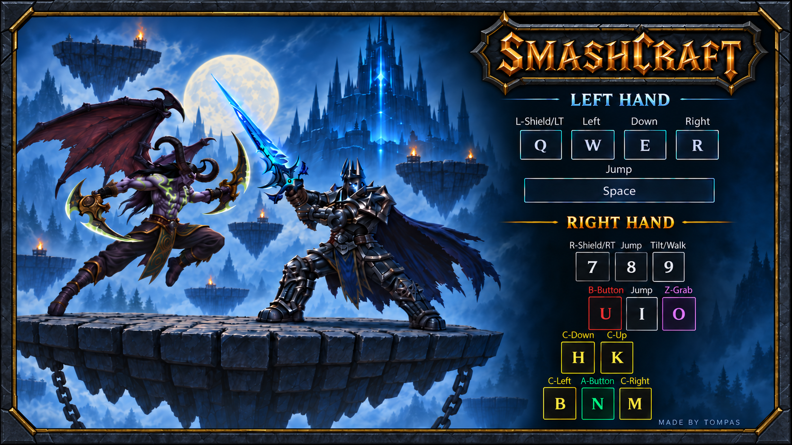

# Smashcraft

  

Smashcraft is an in-development, Melee-inspired platform fighter for Warcraft
III. Archer, Rifleman, and Illidan fight on floating stages with jumps, air
dodges, shields, hitstun, knockback, and stocks.

[Download the playable prototype](https://github.com/tompassarelli/smashcraft/releases/download/prototype-2026-10-01/Smashcraft.w3x)
· [Release notes, installation, and known limits](https://github.com/tompassarelli/smashcraft/releases/tag/prototype-2026-10-01)
· [Player guide](docs/player-guide.md)

The downloadable map is an earlier snapshot. Ongoing development includes newer
gameplay and presentation work; read the release notes to see what the download
contains. Recent two-client tests have demonstrated synchronized matches and
numerical rollback correction. Visible prediction remains pending; see the
[native evidence](docs/native-capability-report.md) for current results and limits.

## Build and test

Gameplay is authored in Wurst and compiled to Lua for Warcraft III. The source
tree does not include Warcraft III's models, textures, terrain map, compiler
artifacts, or generated game map. Building requires the project's locally
configured Warcraft III and toolchain.

From the repository root, run [wc3-melee:test.sh](test.sh) for headless
simulation tests. Compile with [wc3-melee:build.sh](build.sh), passing a
Warcraft III terrain map as the required `.w3m` or `.w3x` argument. See
[development setup](docs/development-loop.md) and
[toolchain notes](docs/wurst-toolchain.md) for the full workflow.

## Project notes

- [Gameplay and controls](docs/player-guide.md)
- [Delivery goal and current sequence](docs/delivery-goal.md)
- [Physics references and implementation](docs/physics.md)
- [Fighter animation authoring and validation](docs/fighter-animation-work.md)
- [Development plan and history](docs/development-plan.md)
- [Netcode proposal](docs/netcode-proposal.md)
- [Native capability and test evidence](docs/native-capability-report.md)
- [Gameplay design decisions](docs/gameplay-design.md)
- [Documentation index](docs/README.md)
