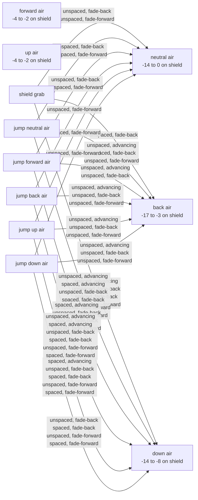
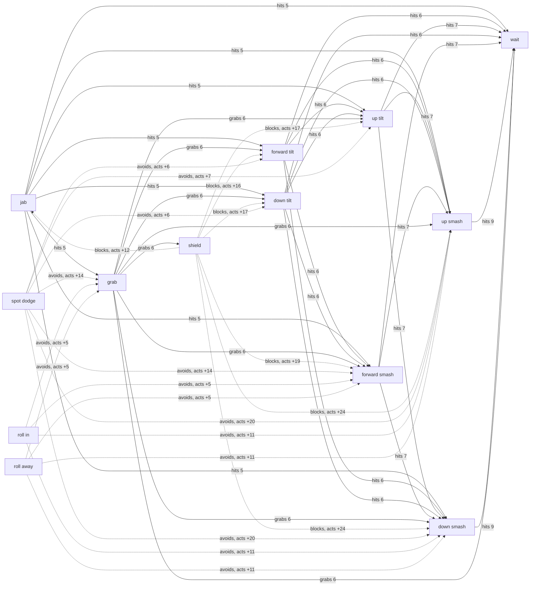
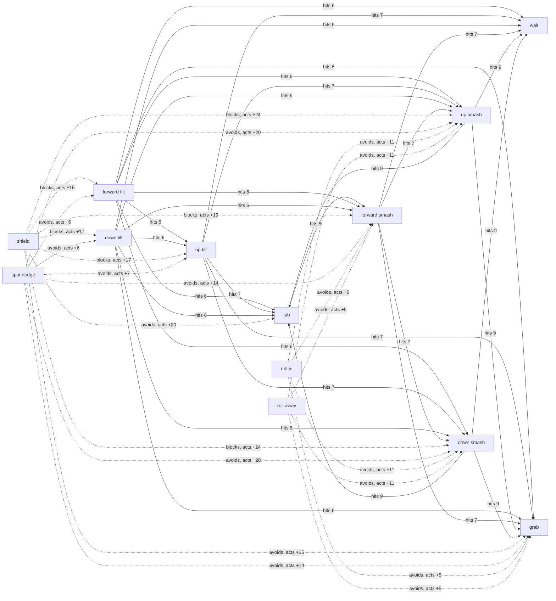
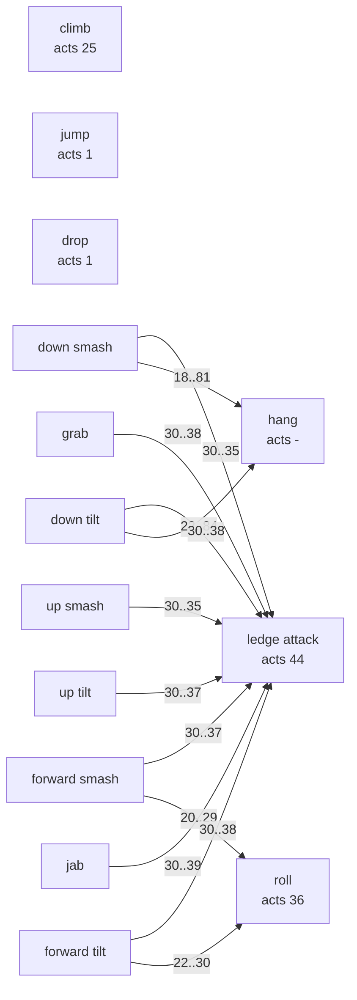
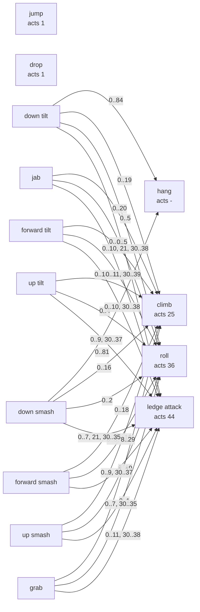

# Archer: interaction graph

Generated by `bun wisp interactions` (smashcraft:ts/scripts/interactions.ts) from the match frame executor and the authored move data; do not edit. The model, its conditions and how to read it: [the interaction graph](../../../docs/design/interaction-graph.md). Archer against Archer on the flat stage; frames are match frames, 60 a second; distances are world units.

## Aerial on shield

Archer short hops at a shielding Archer from a standing start, approaching until the aerial meets the shield. Advancing presses the aerial as late in the hop as still meets the shield and holds no stick after; fade-back and fade-forward press it as early as meets the shield, then hold away or on through for the rest of the fall. Unspaced starts from the nearest distance that reaches the shield, spaced from the farthest. Frame 0 is the frame the aerial meets the shield; the other frames count from it. Advantage is the defender's first action minus the attacker's: negative means the defender acts first. Punish start frames are when the defender's option can start and still land before the attacker can act.

### Start distances that reach the shield

| Aerial | Start distances |
| --- | --- |
| neutral air | 48..186 |
| forward air | 54..264 |
| back air | 48..252 |
| up air | 48..156 |
| down air | 48..96 |

### Frame advantage and punishes

| Aerial | Spacing | Drift | Start | Hit at | Separation | Shieldstun | Attacker acts | Defender acts | Advantage | Punished by (start frames) |
| --- | --- | --- | --- | --- | --- | --- | --- | --- | --- | --- |
| neutral air | unspaced | advancing | 48 | 19 + 3 | -45.66 | 5 | 10 | 10 | 0 | safe |
| neutral air | spaced | advancing | 186 | 19 + 3 | 92.34 | 5 | 10 | 10 | 0 | safe |
| neutral air | unspaced | fade-back | 48 | 4 + 3 | 45.12 | 5 | 24 | 10 | -14 | shield grab 10..15; jump neutral air 10..12; jump forward air 10..15 |
| neutral air | spaced | fade-back | 186 | 5 + 17 | 93.12 | 4 | 9 | 8 | -1 | safe |
| neutral air | unspaced | fade-forward | 48 | 4 + 3 | 45.12 | 5 | 24 | 10 | -14 | shield grab 10..13; jump neutral air 10..17; jump forward air 10..15; jump back air 10..17; jump up air 10..15; jump down air 10..13 |
| neutral air | spaced | fade-forward | 186 | 5 + 17 | 93.12 | 4 | 9 | 8 | -1 | safe |
| forward air | unspaced | advancing | 54 | 17 + 5 | -39.78 | 5 | 12 | 10 | -2 | safe |
| forward air | spaced | advancing | 264 | 17 + 5 | 170.22 | 5 | 12 | 10 | -2 | safe |
| forward air | unspaced | fade-back | 54 | 15 + 5 | -29.82 | 5 | 14 | 10 | -4 | safe |
| forward air | spaced | fade-back | 264 | 16 + 6 | 170.22 | 5 | 12 | 10 | -2 | safe |
| forward air | unspaced | fade-forward | 54 | 15 + 5 | -29.82 | 5 | 14 | 10 | -4 | safe |
| forward air | spaced | fade-forward | 264 | 16 + 6 | 170.22 | 5 | 12 | 10 | -2 | safe |
| back air | unspaced | advancing | 48 | 4 + 3 | 28.92 | 5 | 27 | 10 | -17 | jump neutral air 10..20; jump forward air 10; jump back air 10..20; jump up air 10..18; jump down air 10..16 |
| back air | spaced | advancing | 252 | 19 + 3 | 158.22 | 5 | 13 | 10 | -3 | safe |
| back air | unspaced | fade-back | 48 | 4 + 3 | 28.92 | 5 | 27 | 10 | -17 | shield grab 13..21; jump neutral air 10..20; jump forward air 10..18; jump back air 10..20; jump up air 10..18; jump down air 10..16 |
| back air | spaced | fade-back | 252 | 4 + 18 | 158.22 | 4 | 12 | 8 | -4 | safe |
| back air | unspaced | fade-forward | 48 | 4 + 3 | 28.92 | 5 | 27 | 10 | -17 | jump neutral air 10..20; jump back air 10..20; jump up air 10..11; jump down air 10..15 |
| back air | spaced | fade-forward | 252 | 4 + 18 | 158.22 | 4 | 12 | 8 | -4 | safe |
| up air | unspaced | advancing | 48 | 17 + 5 | -45.78 | 3 | 11 | 7 | -4 | safe |
| up air | spaced | advancing | 156 | 17 + 5 | 62.22 | 3 | 11 | 7 | -4 | safe |
| up air | unspaced | fade-back | 48 | 14 + 5 | -30.84 | 3 | 18 | 15 | -3 | safe |
| up air | spaced | fade-back | 156 | 15 + 7 | 62.22 | 5 | 12 | 10 | -2 | safe |
| up air | unspaced | fade-forward | 48 | 14 + 5 | -30.84 | 3 | 18 | 15 | -3 | safe |
| up air | spaced | fade-forward | 156 | 15 + 7 | 62.22 | 5 | 12 | 10 | -2 | safe |
| down air | unspaced | advancing | 48 | 10 + 7 | -20.88 | 6 | 20 | 12 | -8 | jump neutral air 12..13; jump back air 12..13 |
| down air | spaced | advancing | 96 | 9 + 7 | 32.1 | 6 | 21 | 12 | -9 | shield grab 12..15; jump neutral air 12..14; jump forward air 12; jump back air 12..14; jump up air 12 |
| down air | unspaced | fade-back | 48 | 4 + 7 | 9 | 6 | 26 | 12 | -14 | shield grab 12..20; jump neutral air 12..19; jump forward air 12..17; jump back air 12..19; jump up air 12..17; jump down air 12..15 |
| down air | spaced | fade-back | 96 | 7 + 7 | 42.06 | 6 | 23 | 12 | -11 | shield grab 12..17; jump neutral air 12..16; jump forward air 12..14; jump back air 12..14; jump up air 12..14; jump down air 12 |
| down air | unspaced | fade-forward | 48 | 4 + 7 | 9 | 6 | 26 | 12 | -14 | jump neutral air 12..19; jump back air 12..19; jump up air 12..17; jump down air 12..15 |
| down air | spaced | fade-forward | 96 | 7 + 7 | 42.06 | 6 | 23 | 12 | -11 | shield grab 12..13; jump neutral air 12..16; jump forward air 12..14; jump back air 12..16; jump up air 12..14; jump down air 12 |

### Out of shield, and the attacker's punishes

Each cell: the frame the defender's option lets it act again, then the attacker's ground options that land before that, with their start frames; or, when the option lands on an attacker who waits, that contact.

| Aerial | Spacing | Drift | shield grab | spot dodge | roll in | roll away |
| --- | --- | --- | --- | --- | --- | --- |
| neutral air | unspaced | advancing | acts 46: forward tilt 10..40; forward smash 10..39 | acts 32: forward tilt 19..26; forward smash 17..25 | acts 41: jab 24..26; forward tilt 23..35; up tilt 22..34; down tilt 23..35; forward smash 21..34; up smash 19..32; down smash 19..32; grab 23..25 | acts 41: safe |
| neutral air | spaced | advancing | lands on a waiting attacker: W 15 grab | acts 32: jab 20..27; forward tilt 19..26; up tilt 18..25; down tilt 19..26; forward smash 17..25; up smash 15..23; down smash 15..23; grab 19..26 | acts 41: forward tilt 23..35; forward smash 21..34 | acts 41: safe |
| neutral air | unspaced | fade-back | lands on a waiting attacker: W 15 grab | acts 32: forward tilt 24..26; up tilt 24..25; down tilt 24..26; forward smash 24..25 | acts 41: forward tilt 25..35; forward smash 25..34 | acts 41: safe |
| neutral air | spaced | fade-back | lands on a waiting attacker: W 13 grab | acts 30: jab 18..25; forward tilt 17..24; up tilt 16..23; down tilt 17..24; forward smash 15..23; up smash 13..21; down smash 13..21; grab 17..24 | acts 39: forward tilt 21..33; forward smash 19..32 | acts 39: safe |
| neutral air | unspaced | fade-forward | lands on a waiting attacker: W 15 grab | acts 32: jab 24..27; forward tilt 24..26; up tilt 24..25; down tilt 24..26; forward smash 24..25 | acts 41: safe | acts 41: forward tilt 24..26; up tilt 24..31; down tilt 24..33; forward smash 24..25; down smash 24 |
| neutral air | spaced | fade-forward | lands on a waiting attacker: W 13 grab | acts 30: jab 18..25; forward tilt 17..24; up tilt 16..23; down tilt 17..24; forward smash 15..23; up smash 13..21; down smash 13..21; grab 17..24 | acts 39: forward tilt 21..33; forward smash 19..32 | acts 39: safe |
| forward air | unspaced | advancing | acts 46: forward tilt 12..40; up tilt 12..39; forward smash 12..39; up smash 12..37 | acts 32: forward tilt 19..26; up tilt 18..25; forward smash 17..25; up smash 15..23 | acts 41: jab 24..25; forward tilt 23..33; up tilt 22..34; down tilt 23..35; forward smash 21..31; up smash 19..30; down smash 19..30; grab 23..24 | acts 41: safe |
| forward air | spaced | advancing | acts 46: up tilt 12..39; down tilt 12..40 | acts 32: up tilt 18..25; down tilt 19..26 | acts 41: jab 24..28; forward tilt 23..27, 30..35; up tilt 22..34; down tilt 23..35; forward smash 21..26, 30..34; up smash 19..32; down smash 19..32 | acts 41: safe |
| forward air | unspaced | fade-back | acts 46: forward tilt 14..40; up tilt 14..39; down tilt 14..40; forward smash 14..39; up smash 14..37; down smash 14..37 | acts 32: forward tilt 19..26; up tilt 18..25; down tilt 19..26; forward smash 17..25; up smash 15..23; down smash 15..23 | acts 41: forward tilt 23..27; up tilt 22..34; down tilt 23..35; forward smash 21..26; up smash 19..24; down smash 19..24 | acts 41: safe |
| forward air | spaced | fade-back | acts 46: up tilt 12..39; down tilt 12..40 | acts 32: up tilt 18..25; down tilt 19..26 | acts 41: jab 24..29; forward tilt 23..28, 30..35; up tilt 22..34; down tilt 23..35; forward smash 21..27, 30..34; up smash 19..32; down smash 19..32 | acts 41: safe |
| forward air | unspaced | fade-forward | acts 46: forward tilt 14..40; up tilt 14..39; forward smash 14..39; up smash 14..37 | acts 32: forward tilt 19..26; up tilt 18..25; forward smash 17..25; up smash 15..23 | acts 41: jab 24..25; forward tilt 23..33; up tilt 22..34; down tilt 23..35; forward smash 21..31; up smash 19..30; down smash 19..30; grab 23..24 | acts 41: safe |
| forward air | spaced | fade-forward | acts 46: up tilt 12..39; down tilt 12..40 | acts 32: up tilt 18..25; down tilt 19..26 | acts 41: jab 24..28; forward tilt 23..27, 29..35; up tilt 22..34; down tilt 23..35; forward smash 21..26, 29..34; up smash 19..32; down smash 19..32 | acts 41: safe |
| back air | unspaced | advancing | acts 46: jab 27..41; forward tilt 27..40; up tilt 27..39; down tilt 27..40; forward smash 27..39; up smash 27..37; down smash 27..37; grab 27..40 | acts 32: jab 27 | acts 41: forward tilt 27..33; forward smash 27..32 | acts 41: safe |
| back air | spaced | advancing | acts 46: forward tilt 13..40; forward smash 13..39 | acts 32: forward tilt 19..26; forward smash 17..25 | acts 41: jab 24..36; forward tilt 25..35; up tilt 22..34; down tilt 23..35; forward smash 25..34; up smash 19..32; down smash 19..32; grab 23..35 | acts 41: safe |
| back air | unspaced | fade-back | acts 46: jab 27..41; forward tilt 27..40; up tilt 27..39; down tilt 27..40; forward smash 27..39; up smash 27..37; down smash 27..37 | acts 32: jab 27 | acts 41: safe | acts 41: safe |
| back air | spaced | fade-back | acts 44: forward tilt 12..38; forward smash 12..37 | acts 30: forward tilt 17..24; forward smash 15..23 | acts 39: jab 22..34; forward tilt 24..33; up tilt 20..32; down tilt 21..33; forward smash 24..32; up smash 17..30; down smash 17..30; grab 21..33 | acts 39: safe |
| back air | unspaced | fade-forward | acts 46: jab 27..41; forward tilt 27..40; up tilt 27..39; down tilt 27..40; forward smash 27..39; up smash 27..37; down smash 27..37; grab 27..40 | acts 32: jab 27 | acts 41: forward tilt 27..35; forward smash 27..34 | acts 41: safe |
| back air | spaced | fade-forward | acts 44: forward tilt 12..38; forward smash 12..37 | acts 30: forward tilt 17..24; forward smash 15..23 | acts 39: jab 22..34; forward tilt 24..33; up tilt 20..32; down tilt 21..33; forward smash 24..32; up smash 17..30; down smash 17..30; grab 21..33 | acts 39: safe |
| up air | unspaced | advancing | acts 43: forward tilt 11..37; forward smash 11..36 | acts 29: forward tilt 16..23; forward smash 14..22 | acts 38: jab 21..24; forward tilt 20..32; up tilt 19..31; down tilt 20..32; forward smash 18..31; up smash 16..29; down smash 16..29; grab 20..22 | acts 38: safe |
| up air | spaced | advancing | lands on a waiting attacker: W 12 grab | acts 29: jab 17..24; forward tilt 16..23; up tilt 15..22; down tilt 16..23; forward smash 14..22; up smash 12..20; down smash 12..20; grab 16..23 | acts 38: forward tilt 20..23; forward smash 18..22 | acts 38: safe |
| up air | unspaced | fade-back | acts 51: jab 18..46; forward tilt 18..45; up tilt 18..44; down tilt 18..45; forward smash 18..44; up smash 18..42; down smash 18..42 | acts 37: jab 25..32; forward tilt 24..31; up tilt 23..30; down tilt 24..31; forward smash 22..30; up smash 20..28; down smash 20..28 | acts 46: forward tilt 28..31; up tilt 27..37; down tilt 28..38; forward smash 26..30; up smash 24..29; down smash 24..29 | acts 46: safe |
| up air | spaced | fade-back | lands on a waiting attacker: W 15 grab | acts 32: jab 20..27; forward tilt 19..26; up tilt 18..25; down tilt 19..26; forward smash 17..25; up smash 15..23; down smash 15..23; grab 19..26 | acts 41: forward tilt 23..31; forward smash 21..29 | acts 41: safe |
| up air | unspaced | fade-forward | acts 51: forward tilt 18..45; up tilt 18..44; forward smash 18..44; up smash 18..42 | acts 37: forward tilt 24..31; up tilt 23..30; forward smash 22..30; up smash 20..28 | acts 46: jab 29..30; forward tilt 28..37; up tilt 27..39; down tilt 28..40; forward smash 26..36; up smash 24..35; down smash 24..35; grab 28..29 | acts 46: safe |
| up air | spaced | fade-forward | lands on a waiting attacker: W 15 grab | acts 32: jab 20..27; forward tilt 19..26; up tilt 18..25; down tilt 19..26; forward smash 17..25; up smash 15..23; down smash 15..23; grab 19..26 | acts 41: forward tilt 23..28; forward smash 21..27 | acts 41: safe |
| down air | unspaced | advancing | acts 48: forward tilt 20..42; up tilt 20..41; down tilt 20..42; forward smash 20..41; up smash 20..39; down smash 20..39 | acts 34: forward tilt 21..28; up tilt 20..27; down tilt 21..28; forward smash 20..27; up smash 20..25; down smash 20..25 | acts 43: jab 26..27; forward tilt 25..31; up tilt 24..36; down tilt 25..37; forward smash 23..30; up smash 21..29; down smash 21..30 | acts 43: safe |
| down air | spaced | advancing | lands on a waiting attacker: W 17 grab | acts 34: jab 22..29; forward tilt 21..28; up tilt 21..27; down tilt 21..28; forward smash 21..27; up smash 21..25; down smash 21..25; grab 21..28 | acts 43: safe | acts 43: up tilt 24..26; down tilt 25..27 |
| down air | unspaced | fade-back | lands on a waiting attacker: W 17 grab | acts 34: jab 26..29; forward tilt 26..28; up tilt 26..27; down tilt 26..28; forward smash 26..27; grab 26..28 | acts 43: safe | acts 43: up tilt 26; down tilt 26..27 |
| down air | spaced | fade-back | lands on a waiting attacker: W 17 grab | acts 34: jab 23..29; forward tilt 23..28; up tilt 23..27; down tilt 23..28; forward smash 23..27; up smash 23..25; down smash 23..25; grab 23..28 | acts 43: forward tilt 25..27; forward smash 23..26 | acts 43: safe |
| down air | unspaced | fade-forward | acts 48: forward tilt 26..42; forward smash 26..41 | acts 34: forward tilt 26..28; forward smash 26..27 | acts 43: jab 26..28; forward tilt 26..36; up tilt 26..36; down tilt 26..37; forward smash 26..34; up smash 26..34; down smash 26..34; grab 26 | acts 43: safe |
| down air | spaced | fade-forward | lands on a waiting attacker: W 17 grab | acts 34: jab 23..29; forward tilt 23..28; up tilt 23..27; down tilt 23..28; forward smash 23..27; up smash 23..25; down smash 23..25 | acts 43: safe | acts 43: forward tilt 25..26; up tilt 24..27; down tilt 25..28; forward smash 23..25; up smash 23; down smash 23..24 |

### Follow-ups: the defender's options against the attacker's

Rows are the defender's options, columns the attacker's, each from the first frame it can start. W/L: the row lands first (W) or is hit first (L) on that frame; T: both on one frame; a signed number: neither lands and the row can act that many frames before (+) or after (-) the column; (shield): an attack met a shield first.

neutral air, unspaced, advancing

|  | wait | jab | grab | shield | spot dodge | roll away |
| --- | --- | --- | --- | --- | --- | --- |
| hold shield | 0 | +21 | +36 | +1 | +22 | +31 |
| shield grab | -36 | -15 | 0 | -35 | -14 | -5 |
| jump neutral air | W 16 | W 16 | W 16 | -14 (shield) | W 25 | +4 |
| jump forward air | -29 | -8 | +7 | -28 | -7 | +2 |
| jump back air | W 16 | W 16 | W 16 | -17 (shield) | W 25 | +1 |
| jump up air | W 18 | W 19 | W 18 | W 18 | -7 | +2 |
| jump down air | W 20 | W 20 | W 20 | -14 (shield) | W 25 | 0 |
| spot dodge | -22 | -1 | +14 | -21 | 0 | +9 |
| roll in | -31 | -10 | +5 | -30 | -9 | 0 |
| roll away | -31 | -10 | +5 | -30 | -9 | 0 |

neutral air, spaced, advancing

|  | wait | jab | grab | shield | spot dodge | roll away |
| --- | --- | --- | --- | --- | --- | --- |
| hold shield | 0 | +12 (shield) | L 15 grab | +1 | +22 | +31 |
| shield grab | W 15 grab | L 14 | 0 | W 15 grab | -14 | -5 |
| jump neutral air | W 16 | L 14 | L 15 grab | W 16 | W 25 | +4 |
| jump forward air | W 18 | L 14 | L 15 grab | W 18 | -7 | +2 |
| jump back air | W 27 | L 14 | L 15 grab | W 27 | W 29 | +1 |
| jump up air | -29 | L 14 | L 15 grab | -28 | -7 | +2 |
| jump down air | W 22 | L 14 | L 15 grab | W 22 | W 25 | 0 |
| spot dodge | -22 | -1 | +14 | -21 | 0 | +9 |
| roll in | -31 | -10 | +5 | -30 | -9 | 0 |
| roll away | -31 | -10 | +5 | -30 | -9 | 0 |

neutral air, unspaced, fade-back

|  | wait | jab | grab | shield | spot dodge | roll away |
| --- | --- | --- | --- | --- | --- | --- |
| hold shield | +14 | +35 | +50 | +15 | +36 | +45 |
| shield grab | W 15 grab | W 15 grab | W 15 grab | W 15 grab | W 15 grab | W 15 grab |
| jump neutral air | W 16 | W 16 | W 16 | W 16 | W 16 | W 16 |
| jump forward air | W 18 | W 18 | W 18 | W 18 | W 18 | W 18 |
| jump back air | -16 | L 28 | L 29 grab | -15 | +6 | +15 |
| jump up air | -15 | L 28 | L 29 grab | -14 | +7 | +16 |
| jump down air | -17 | L 28 | L 29 grab | -16 | +5 | +14 |
| spot dodge | -8 | +13 | +28 | -7 | +14 | +23 |
| roll in | -17 | +4 | +19 | -16 | +5 | +14 |
| roll away | -17 | +4 | +19 | -16 | +5 | +14 |

neutral air, spaced, fade-back

|  | wait | jab | grab | shield | spot dodge | roll away |
| --- | --- | --- | --- | --- | --- | --- |
| hold shield | +1 | +12 (shield) | L 14 grab | +2 | +23 | +32 |
| shield grab | W 13 grab | W 13 grab | W 13 grab | W 13 grab | -13 | -4 |
| jump neutral air | W 14 | L 13 | L 14 grab | W 14 | W 24 | +5 |
| jump forward air | W 16 | L 13 | L 14 grab | W 16 | -6 | +3 |
| jump back air | W 25 | L 13 | L 14 grab | W 25 | W 27 | +2 |
| jump up air | -28 | L 13 | L 14 grab | -27 | -6 | +3 |
| jump down air | W 20 | L 13 | L 14 grab | W 20 | W 24 | +1 |
| spot dodge | -21 | 0 | +15 | -20 | +1 | +10 |
| roll in | -30 | -9 | +6 | -29 | -8 | +1 |
| roll away | -30 | -9 | +6 | -29 | -8 | +1 |

neutral air, unspaced, fade-forward

|  | wait | jab | grab | shield | spot dodge | roll away |
| --- | --- | --- | --- | --- | --- | --- |
| hold shield | +14 | +12 (shield) | +50 | +15 | +36 | +45 |
| shield grab | W 15 grab | W 15 grab | W 15 grab | W 15 grab | W 15 grab | W 15 grab |
| jump neutral air | W 16 | W 16 | W 16 | W 16 | W 16 | W 16 |
| jump forward air | W 18 | W 18 | W 18 | W 18 | W 18 | W 18 |
| jump back air | W 16 | W 16 | W 16 | W 16 | W 16 | W 16 |
| jump up air | W 18 | W 18 | W 18 | W 18 | W 18 | W 18 |
| jump down air | W 20 | W 20 | W 20 | W 20 | W 20 | W 20 |
| spot dodge | -8 | L 28 | +28 | -7 | +14 | +23 |
| roll in | -17 | +4 | +19 | -16 | +5 | +14 |
| roll away | -17 | +4 | +19 | -16 | +5 | +14 |

neutral air, spaced, fade-forward

|  | wait | jab | grab | shield | spot dodge | roll away |
| --- | --- | --- | --- | --- | --- | --- |
| hold shield | +1 | +12 (shield) | L 14 grab | +2 | +23 | +32 |
| shield grab | W 13 grab | W 13 grab | W 13 grab | W 13 grab | -13 | -4 |
| jump neutral air | W 14 | L 13 | L 14 grab | W 14 | W 24 | +5 |
| jump forward air | W 16 | L 13 | L 14 grab | W 16 | -6 | +3 |
| jump back air | W 25 | L 13 | L 14 grab | W 25 | W 26 | +2 |
| jump up air | -28 | L 13 | L 14 grab | -27 | -6 | +3 |
| jump down air | W 18 | L 13 | L 14 grab | W 18 | W 24 | +1 |
| spot dodge | -21 | 0 | +15 | -20 | +1 | +10 |
| roll in | -30 | -9 | +6 | -29 | -8 | +1 |
| roll away | -30 | -9 | +6 | -29 | -8 | +1 |

forward air, unspaced, advancing

|  | wait | jab | grab | shield | spot dodge | roll away |
| --- | --- | --- | --- | --- | --- | --- |
| hold shield | +2 | +23 | +38 | +3 | +24 | +33 |
| shield grab | -34 | -13 | +2 | -33 | -12 | -3 |
| jump neutral air | W 16 | W 16 | W 16 | -14 (shield) | W 27 | +6 |
| jump forward air | -27 | -6 | +9 | -26 | -5 | +4 |
| jump back air | W 16 | W 16 | W 16 | -17 (shield) | W 27 | W 31 |
| jump up air | W 18 | W 18 | W 18 | W 18 | -5 | +4 |
| jump down air | W 20 | W 20 | W 20 | -14 (shield) | W 27 | +2 |
| spot dodge | -20 | +1 | +16 | -19 | +2 | +11 |
| roll in | -29 | -8 | +7 | -28 | -7 | +2 |
| roll away | -29 | -8 | +7 | -28 | -7 | +2 |

forward air, spaced, advancing

|  | wait | jab | grab | shield | spot dodge | roll away |
| --- | --- | --- | --- | --- | --- | --- |
| hold shield | +2 | +23 | +38 | +3 | +24 | +33 |
| shield grab | -34 | -13 | +2 | -33 | -12 | -3 |
| jump neutral air | -25 | -4 | +11 | -1 (shield) | -3 | +6 |
| jump forward air | W 18 | W 18 | W 18 | W 18 | -5 | +4 |
| jump back air | -28 | -7 | +8 | -27 | -6 | +3 |
| jump up air | -27 | -6 | +9 | -26 | -5 | +4 |
| jump down air | -29 | -8 | +7 | -28 | -7 | +2 |
| spot dodge | -20 | +1 | +16 | -19 | +2 | +11 |
| roll in | -29 | -8 | +7 | -28 | -7 | +2 |
| roll away | -29 | -8 | +7 | -28 | -7 | +2 |

forward air, unspaced, fade-back

|  | wait | jab | grab | shield | spot dodge | roll away |
| --- | --- | --- | --- | --- | --- | --- |
| hold shield | +4 | +12 (shield) | +40 | +5 | +26 | +35 |
| shield grab | -32 | -11 | +4 | -31 | -10 | -1 |
| jump neutral air | W 16 | W 16 | W 16 | -19 (shield) | W 29 | W 16 |
| jump forward air | W 18 | W 18 | W 18 | W 18 | -3 | +6 |
| jump back air | W 16 | W 16 | W 16 | -22 (shield) | W 29 | W 16 |
| jump up air | W 18 | T 18 | W 18 | W 18 | -3 | +6 |
| jump down air | W 20 | W 20 | W 20 | -14 (shield) | W 29 | +4 |
| spot dodge | -18 | +3 | +18 | -17 | +4 | +13 |
| roll in | -27 | -6 | +9 | -26 | -5 | +4 |
| roll away | -27 | -6 | +9 | -26 | -5 | +4 |

forward air, spaced, fade-back

|  | wait | jab | grab | shield | spot dodge | roll away |
| --- | --- | --- | --- | --- | --- | --- |
| hold shield | +2 | +23 | +38 | +3 | +24 | +33 |
| shield grab | -34 | -13 | +2 | -33 | -12 | -3 |
| jump neutral air | -25 | -4 | +11 | -1 (shield) | -3 | +6 |
| jump forward air | W 18 | W 18 | W 18 | W 18 | -5 | +4 |
| jump back air | -28 | -7 | +8 | -27 | -6 | +3 |
| jump up air | -27 | -6 | +9 | -26 | -5 | +4 |
| jump down air | -29 | -8 | +7 | -28 | -7 | +2 |
| spot dodge | -20 | +1 | +16 | -19 | +2 | +11 |
| roll in | -29 | -8 | +7 | -28 | -7 | +2 |
| roll away | -29 | -8 | +7 | -28 | -7 | +2 |

forward air, unspaced, fade-forward

|  | wait | jab | grab | shield | spot dodge | roll away |
| --- | --- | --- | --- | --- | --- | --- |
| hold shield | +4 | +25 | +40 | +5 | +26 | +35 |
| shield grab | -32 | -11 | +4 | -31 | -10 | -1 |
| jump neutral air | W 16 | W 16 | W 16 | -19 (shield) | W 29 | W 16 |
| jump forward air | -25 | -4 | +11 | -24 | -3 | +6 |
| jump back air | W 16 | W 16 | W 16 | -22 (shield) | W 29 | W 16 |
| jump up air | W 18 | W 18 | W 18 | W 18 | -3 | +6 |
| jump down air | W 20 | W 20 | W 20 | -14 (shield) | W 29 | +4 |
| spot dodge | -18 | +3 | +18 | -17 | +4 | +13 |
| roll in | -27 | -6 | +9 | -26 | -5 | +4 |
| roll away | -27 | -6 | +9 | -26 | -5 | +4 |

forward air, spaced, fade-forward

|  | wait | jab | grab | shield | spot dodge | roll away |
| --- | --- | --- | --- | --- | --- | --- |
| hold shield | +2 | +23 | +38 | +3 | +24 | +33 |
| shield grab | -34 | -13 | +2 | -33 | -12 | -3 |
| jump neutral air | -25 | -4 | +11 | -1 (shield) | -3 | +6 |
| jump forward air | W 18 | W 18 | W 18 | W 18 | -5 | +4 |
| jump back air | -28 | -7 | +8 | -27 | -6 | +3 |
| jump up air | -27 | -6 | +9 | -26 | -5 | +4 |
| jump down air | -29 | -8 | +7 | -28 | -7 | +2 |
| spot dodge | -20 | +1 | +16 | -19 | +2 | +11 |
| roll in | -29 | -8 | +7 | -28 | -7 | +2 |
| roll away | -29 | -8 | +7 | -28 | -7 | +2 |

back air, unspaced, advancing

|  | wait | jab | grab | shield | spot dodge | roll away |
| --- | --- | --- | --- | --- | --- | --- |
| hold shield | +17 | +12 (shield) | L 32 grab | +18 | +39 | +48 |
| shield grab | -19 | L 31 | L 32 grab | -18 | +3 | +12 |
| jump neutral air | W 16 | W 16 | W 16 | W 16 | W 16 | W 16 |
| jump forward air | W 18 | W 18 | W 18 | W 18 | W 18 | W 18 |
| jump back air | W 16 | W 16 | W 16 | W 16 | W 16 | W 16 |
| jump up air | W 18 | W 18 | W 18 | W 18 | W 18 | W 18 |
| jump down air | W 20 | W 20 | W 20 | W 20 | W 20 | W 20 |
| spot dodge | -5 | L 31 | L 32 grab | -4 | +17 | +26 |
| roll in | -14 | +7 | +22 | -13 | +8 | +17 |
| roll away | -14 | +7 | +22 | -13 | +8 | +17 |

back air, spaced, advancing

|  | wait | jab | grab | shield | spot dodge | roll away |
| --- | --- | --- | --- | --- | --- | --- |
| hold shield | +3 | +24 | +39 | +4 | +25 | +34 |
| shield grab | -33 | -12 | +3 | -32 | -11 | -2 |
| jump neutral air | W 25 | W 25 | W 25 | W 25 | W 28 | +7 |
| jump forward air | W 18 | W 18 | W 18 | W 18 | -4 | +5 |
| jump back air | -27 | -6 | +9 | -26 | -5 | +4 |
| jump up air | -26 | -5 | +10 | -25 | -4 | +5 |
| jump down air | -28 | -7 | +8 | -27 | -6 | +3 |
| spot dodge | -19 | +2 | +17 | -18 | +3 | +12 |
| roll in | -28 | -7 | +8 | -27 | -6 | +3 |
| roll away | -28 | -7 | +8 | -27 | -6 | +3 |

back air, unspaced, fade-back

|  | wait | jab | grab | shield | spot dodge | roll away |
| --- | --- | --- | --- | --- | --- | --- |
| hold shield | +17 | +12 (shield) | +53 | +18 | +39 | +48 |
| shield grab | -19 | L 31 | +17 | -18 | +3 | +12 |
| jump neutral air | W 16 | W 16 | W 16 | W 16 | W 16 | W 16 |
| jump forward air | W 18 | W 18 | W 18 | W 18 | W 18 | W 18 |
| jump back air | W 16 | W 16 | W 16 | W 16 | W 16 | W 16 |
| jump up air | W 18 | W 18 | W 18 | W 18 | W 18 | W 18 |
| jump down air | W 20 | W 20 | W 20 | W 20 | W 20 | W 20 |
| spot dodge | -5 | L 31 | +31 | -4 | +17 | +26 |
| roll in | -14 | +7 | +22 | -13 | +8 | +17 |
| roll away | -14 | +7 | +22 | -13 | +8 | +17 |

back air, spaced, fade-back

|  | wait | jab | grab | shield | spot dodge | roll away |
| --- | --- | --- | --- | --- | --- | --- |
| hold shield | +4 | +25 | +40 | +5 | +26 | +35 |
| shield grab | -32 | -11 | +4 | -31 | -10 | -1 |
| jump neutral air | W 24 | W 24 | W 24 | W 24 | W 27 | +8 |
| jump forward air | W 16 | W 16 | W 16 | W 16 | -3 | +6 |
| jump back air | -26 | -5 | +10 | -25 | -4 | +5 |
| jump up air | -25 | -4 | +11 | -24 | -3 | +6 |
| jump down air | -27 | -6 | +9 | -26 | -5 | +4 |
| spot dodge | -18 | +3 | +18 | -17 | +4 | +13 |
| roll in | -27 | -6 | +9 | -26 | -5 | +4 |
| roll away | -27 | -6 | +9 | -26 | -5 | +4 |

back air, unspaced, fade-forward

|  | wait | jab | grab | shield | spot dodge | roll away |
| --- | --- | --- | --- | --- | --- | --- |
| hold shield | +17 | +12 (shield) | L 32 grab | +18 | +39 | +48 |
| shield grab | -19 | L 31 | L 32 grab | -18 | +3 | +12 |
| jump neutral air | W 16 | W 16 | W 16 | W 16 | W 16 | W 16 |
| jump forward air | -12 | L 31 | L 32 grab | -11 | +10 | +19 |
| jump back air | W 16 | W 16 | W 16 | W 16 | W 16 | W 16 |
| jump up air | W 18 | W 18 | W 18 | W 18 | W 18 | W 18 |
| jump down air | W 20 | W 20 | W 20 | W 20 | W 20 | W 20 |
| spot dodge | -5 | L 31 | L 32 grab | -4 | +17 | +26 |
| roll in | -14 | +7 | +22 | -13 | +8 | +17 |
| roll away | -14 | +7 | +22 | -13 | +8 | +17 |

back air, spaced, fade-forward

|  | wait | jab | grab | shield | spot dodge | roll away |
| --- | --- | --- | --- | --- | --- | --- |
| hold shield | +4 | +25 | +40 | +5 | +26 | +35 |
| shield grab | -32 | -11 | +4 | -31 | -10 | -1 |
| jump neutral air | W 23 | W 23 | W 23 | W 23 | W 27 | +8 |
| jump forward air | W 16 | W 16 | W 16 | W 16 | -3 | +6 |
| jump back air | -26 | -5 | +10 | -25 | -4 | +5 |
| jump up air | -25 | -4 | +11 | -24 | -3 | +6 |
| jump down air | -27 | -6 | +9 | -26 | -5 | +4 |
| spot dodge | -18 | +3 | +18 | -17 | +4 | +13 |
| roll in | -27 | -6 | +9 | -26 | -5 | +4 |
| roll away | -27 | -6 | +9 | -26 | -5 | +4 |

up air, unspaced, advancing

|  | wait | jab | grab | shield | spot dodge | roll away |
| --- | --- | --- | --- | --- | --- | --- |
| hold shield | +4 | +25 | +40 | +5 | +26 | +35 |
| shield grab | -32 | -11 | +4 | -31 | -10 | -1 |
| jump neutral air | W 13 | W 13 | W 13 | -19 (shield) | W 26 | W 13 |
| jump forward air | -25 | -4 | +11 | -24 | -3 | +6 |
| jump back air | W 13 | W 13 | W 13 | -22 (shield) | W 26 | W 13 |
| jump up air | -25 | -4 | +11 | -24 | -3 | +6 |
| jump down air | W 17 | W 17 | W 17 | W 17 | W 26 | +4 |
| spot dodge | -18 | +3 | +18 | -17 | +4 | +13 |
| roll in | -27 | -6 | +9 | -26 | -5 | +4 |
| roll away | -27 | -6 | +9 | -26 | -5 | +4 |

up air, spaced, advancing

|  | wait | jab | grab | shield | spot dodge | roll away |
| --- | --- | --- | --- | --- | --- | --- |
| hold shield | +4 | +12 (shield) | L 16 grab | +5 | +26 | +35 |
| shield grab | W 12 grab | W 12 grab | W 12 grab | W 12 grab | -10 | W 12 grab |
| jump neutral air | W 13 | W 13 | W 13 | -19 (shield) | W 26 | W 13 |
| jump forward air | W 15 | T 15 | W 15 | W 15 | -3 | +6 |
| jump back air | W 18 | L 15 | L 16 grab | W 18 | W 26 | +5 |
| jump up air | W 15 | T 15 | W 15 | W 15 | -3 | +6 |
| jump down air | W 17 | L 15 | L 16 grab | -14 (shield) | W 26 | +4 |
| spot dodge | -18 | +3 | +18 | -17 | +4 | +13 |
| roll in | -27 | -6 | +9 | -26 | -5 | +4 |
| roll away | -27 | -6 | +9 | -26 | -5 | +4 |

up air, unspaced, fade-back

|  | wait | jab | grab | shield | spot dodge | roll away |
| --- | --- | --- | --- | --- | --- | --- |
| hold shield | +3 (shield) | +12 (shield) | +39 (shield) | +4 (shield) | +25 (shield) | +34 (shield) |
| shield grab | -33 (shield) | L 22 | +3 | -32 | -11 | -2 |
| jump neutral air | W 21 (shield) | W 21 | W 21 | -19 (shield) | W 33 | +7 |
| jump forward air | W 23 (shield) | W 23 | W 23 | W 23 | -4 | +5 |
| jump back air | W 21 (shield) | W 21 | W 21 | -22 (shield) | W 33 | +4 |
| jump up air | W 23 (shield) | L 22 | W 23 | W 23 | -4 | +5 |
| jump down air | W 25 (shield) | L 22 | W 25 | -14 (shield) | W 33 | +3 |
| spot dodge | -19 (shield) | +2 | +17 | -18 | +3 | +12 |
| roll in | -28 (shield) | -7 | +8 | -27 | -6 | +3 |
| roll away | -28 (shield) | -7 | +8 | -27 | -6 | +3 |

up air, spaced, fade-back

|  | wait | jab | grab | shield | spot dodge | roll away |
| --- | --- | --- | --- | --- | --- | --- |
| hold shield | +2 | +12 (shield) | L 17 grab | +3 | +24 | +33 |
| shield grab | W 15 grab | W 15 grab | W 15 grab | W 15 grab | -12 | -3 |
| jump neutral air | W 16 | T 16 | W 16 | -14 (shield) | W 27 | +6 |
| jump forward air | W 18 | L 16 | L 17 grab | W 18 | -5 | +4 |
| jump back air | W 24 | L 16 | L 17 grab | W 24 | W 27 | +3 |
| jump up air | W 18 | L 16 | L 17 grab | W 18 | -5 | +4 |
| jump down air | W 20 | L 16 | L 17 grab | -14 (shield) | W 27 | +2 |
| spot dodge | -20 | +1 | +16 | -19 | +2 | +11 |
| roll in | -29 | -8 | +7 | -28 | -7 | +2 |
| roll away | -29 | -8 | +7 | -28 | -7 | +2 |

up air, unspaced, fade-forward

|  | wait | jab | grab | shield | spot dodge | roll away |
| --- | --- | --- | --- | --- | --- | --- |
| hold shield | +3 (shield) | +24 (shield) | +39 (shield) | +4 (shield) | +25 (shield) | +34 (shield) |
| shield grab | -33 (shield) | -12 | +3 | -32 | -11 | -2 |
| jump neutral air | W 21 (shield) | W 21 | W 21 | -19 (shield) | W 33 | +7 |
| jump forward air | -26 (shield) | -5 | +10 | -25 | -4 | +5 |
| jump back air | W 21 (shield) | W 21 | W 21 | -22 (shield) | W 33 | +4 |
| jump up air | W 23 (shield) | W 23 | W 23 | W 23 | -4 | +5 |
| jump down air | W 25 (shield) | W 25 | W 25 | -14 (shield) | W 33 | +3 |
| spot dodge | -19 (shield) | +2 | +17 | -18 | +3 | +12 |
| roll in | -28 (shield) | -7 | +8 | -27 | -6 | +3 |
| roll away | -28 (shield) | -7 | +8 | -27 | -6 | +3 |

up air, spaced, fade-forward

|  | wait | jab | grab | shield | spot dodge | roll away |
| --- | --- | --- | --- | --- | --- | --- |
| hold shield | +2 | +12 (shield) | L 17 grab | +3 | +24 | +33 |
| shield grab | W 15 grab | W 15 grab | W 15 grab | W 15 grab | -12 | -3 |
| jump neutral air | W 16 | T 16 | W 16 | -14 (shield) | W 27 | +6 |
| jump forward air | W 18 | L 16 | L 17 grab | W 18 | -5 | +4 |
| jump back air | W 23 | L 16 | L 17 grab | W 23 | W 27 | +3 |
| jump up air | W 18 | L 16 | L 17 grab | W 18 | -5 | +4 |
| jump down air | W 20 | L 16 | L 17 grab | -14 (shield) | W 27 | +2 |
| spot dodge | -20 | +1 | +16 | -19 | +2 | +11 |
| roll in | -29 | -8 | +7 | -28 | -7 | +2 |
| roll away | -29 | -8 | +7 | -28 | -7 | +2 |

down air, unspaced, advancing

|  | wait | jab | grab | shield | spot dodge | roll away |
| --- | --- | --- | --- | --- | --- | --- |
| hold shield | +8 | +29 | +44 | +9 | +30 | +39 |
| shield grab | -28 | -7 | +8 | -27 | -6 | +3 |
| jump neutral air | W 18 | W 18 | W 18 | W 18 | W 18 | W 18 |
| jump forward air | -21 | L 25 | +15 | -20 | +1 | +10 |
| jump back air | W 18 | W 18 | W 18 | W 18 | W 18 | W 18 |
| jump up air | W 20 | W 20 | W 20 | W 20 | W 20 | W 20 |
| jump down air | W 22 | W 22 | W 22 | -20 (shield) | -1 | W 22 |
| spot dodge | -14 | +7 | +22 | -13 | +8 | +17 |
| roll in | -23 | -2 | +13 | -22 | -1 | +8 |
| roll away | -23 | -2 | +13 | -22 | -1 | +8 |

down air, spaced, advancing

|  | wait | jab | grab | shield | spot dodge | roll away |
| --- | --- | --- | --- | --- | --- | --- |
| hold shield | +9 | +12 (shield) | L 26 grab | +10 | +31 | +40 |
| shield grab | W 17 grab | W 17 grab | W 17 grab | W 17 grab | W 17 grab | W 17 grab |
| jump neutral air | W 18 | W 18 | W 18 | W 18 | W 18 | W 18 |
| jump forward air | W 20 | W 20 | W 20 | W 20 | W 20 | W 20 |
| jump back air | W 18 | W 18 | W 18 | W 18 | W 18 | W 18 |
| jump up air | W 20 | W 20 | W 20 | W 20 | W 20 | W 20 |
| jump down air | W 22 | W 22 | W 22 | -20 (shield) | 0 | W 22 |
| spot dodge | -13 | +8 | L 27 grab | -12 | +9 | +18 |
| roll in | -22 | -1 | +14 | -21 | 0 | +9 |
| roll away | -22 | -1 | +14 | -21 | 0 | +9 |

down air, unspaced, fade-back

|  | wait | jab | grab | shield | spot dodge | roll away |
| --- | --- | --- | --- | --- | --- | --- |
| hold shield | +14 | +12 (shield) | L 31 grab | +15 | +36 | +45 |
| shield grab | W 17 grab | W 17 grab | W 17 grab | W 17 grab | W 17 grab | W 17 grab |
| jump neutral air | W 18 | W 18 | W 18 | W 18 | W 18 | W 18 |
| jump forward air | W 20 | W 20 | W 20 | W 20 | W 20 | W 20 |
| jump back air | W 18 | W 18 | W 18 | W 18 | W 18 | W 18 |
| jump up air | W 20 | W 20 | W 20 | W 20 | W 20 | W 20 |
| jump down air | W 22 | W 22 | W 22 | W 22 | W 22 | W 22 |
| spot dodge | -8 | L 30 | L 31 grab | -7 | +14 | +23 |
| roll in | -17 | +4 | +19 | -16 | +5 | +14 |
| roll away | -17 | +4 | +19 | -16 | +5 | +14 |

down air, spaced, fade-back

|  | wait | jab | grab | shield | spot dodge | roll away |
| --- | --- | --- | --- | --- | --- | --- |
| hold shield | +11 | +12 (shield) | L 28 grab | +12 | +33 | +42 |
| shield grab | W 17 grab | W 17 grab | W 17 grab | W 17 grab | W 17 grab | W 17 grab |
| jump neutral air | W 18 | W 18 | W 18 | W 18 | W 18 | W 18 |
| jump forward air | W 20 | W 20 | W 20 | W 20 | W 20 | W 20 |
| jump back air | W 20 | W 20 | W 20 | W 20 | W 20 | W 20 |
| jump up air | W 20 | W 20 | W 20 | W 20 | W 20 | W 20 |
| jump down air | W 22 | W 22 | W 22 | W 22 | W 22 | W 22 |
| spot dodge | -11 | L 27 | L 28 grab | -10 | +11 | +20 |
| roll in | -20 | +1 | +16 | -19 | +2 | +11 |
| roll away | -20 | +1 | +16 | -19 | +2 | +11 |

down air, unspaced, fade-forward

|  | wait | jab | grab | shield | spot dodge | roll away |
| --- | --- | --- | --- | --- | --- | --- |
| hold shield | +14 | +35 | +50 | +15 | +36 | +45 |
| shield grab | -22 | -1 | +14 | -21 | 0 | +9 |
| jump neutral air | W 18 | W 18 | W 18 | W 18 | W 18 | W 18 |
| jump forward air | -15 | L 30 | L 31 grab | -14 | +7 | +16 |
| jump back air | W 18 | W 18 | W 18 | W 18 | W 18 | W 18 |
| jump up air | W 20 | W 20 | W 20 | W 20 | W 20 | W 20 |
| jump down air | W 22 | W 22 | W 22 | W 22 | W 22 | W 22 |
| spot dodge | -8 | +13 | +28 | -7 | +14 | +23 |
| roll in | -17 | L 31 | L 31 grab | -16 | +5 | +14 |
| roll away | -17 | +4 | +19 | -16 | +5 | +14 |

down air, spaced, fade-forward

|  | wait | jab | grab | shield | spot dodge | roll away |
| --- | --- | --- | --- | --- | --- | --- |
| hold shield | +11 | +12 (shield) | +47 | +12 | +33 | +42 |
| shield grab | W 17 grab | W 17 grab | W 17 grab | W 17 grab | W 17 grab | W 17 grab |
| jump neutral air | W 18 | W 18 | W 18 | W 18 | W 18 | W 18 |
| jump forward air | W 20 | W 20 | W 20 | W 20 | W 20 | W 20 |
| jump back air | W 18 | W 18 | W 18 | W 18 | W 18 | W 18 |
| jump up air | W 20 | W 20 | W 20 | W 20 | W 20 | W 20 |
| jump down air | W 22 | W 22 | W 22 | W 22 | W 22 | W 22 |
| spot dodge | -11 | L 27 | +25 | -10 | +11 | +20 |
| roll in | -20 | +1 | +16 | -19 | +2 | +11 |
| roll away | -20 | +1 | +16 | -19 | +2 | +11 |

### Graph

Each arrow runs from an out-of-shield option to an aerial it punishes, labelled with the spacings and drifts it punishes it at.

## Aerial on a powershield (parry)

The same approaches as on a held shield, but the defending Archer stands unshielded and presses its shield the frame before the aerial meets it, so the hit is parried: no shieldstun, and the shield drops with no release lag into any grounded option. Frame 0 is the parried contact. Its options are every ground attack as well as the out-of-shield ones. Advantage reads as above; "held" is the same approach's advantage on a held shield. Punish start frames are when the defender's option can start and still land before the attacker can act.

| Aerial | Spacing | Drift | Start | Parried | Attacker acts | Defender acts | Advantage | Held | Punished by (start frames) |
| --- | --- | --- | --- | --- | --- | --- | --- | --- | --- |
| neutral air | unspaced | advancing | 48 | yes | 10 | 5 | -5 | 0 | safe |
| neutral air | spaced | advancing | 186 | yes | 10 | 5 | -5 | 0 | safe |
| neutral air | unspaced | fade-back | 48 | yes | 24 | 5 | -19 | -14 | shield grab 5..10; jump neutral air 5..9; jump forward air 5..15; jump up air 5 |
| neutral air | spaced | fade-back | 186 | yes | 9 | 4 | -5 | -1 | safe |
| neutral air | unspaced | fade-forward | 48 | yes | 24 | 5 | -19 | -14 | shield grab 5..18; jump neutral air 5..17; jump forward air 5..15; jump back air 5..17; jump up air 5..15; jump down air 5..13 |
| neutral air | spaced | fade-forward | 186 | yes | 9 | 4 | -5 | -1 | safe |
| forward air | unspaced | advancing | 54 | yes | 12 | 5 | -7 | -2 | jump neutral air 5; jump back air 5 |
| forward air | spaced | advancing | 264 | yes | 12 | 5 | -7 | -2 | safe |
| forward air | unspaced | fade-back | 54 | yes | 14 | 5 | -9 | -4 | jump neutral air 5..7; jump forward air 5; jump back air 5..7; jump up air 5 |
| forward air | spaced | fade-back | 264 | yes | 12 | 5 | -7 | -2 | safe |
| forward air | unspaced | fade-forward | 54 | yes | 14 | 5 | -9 | -4 | jump neutral air 5..7; jump back air 5..7; jump up air 5 |
| forward air | spaced | fade-forward | 264 | yes | 12 | 5 | -7 | -2 | safe |
| back air | unspaced | advancing | 48 | yes | 27 | 5 | -22 | -17 | jump neutral air 5..20; jump forward air 5..7; jump back air 5..20; jump up air 5..10; jump down air 5..14 |
| back air | spaced | advancing | 252 | yes | 13 | 5 | -8 | -3 | shield grab 6..7 |
| back air | unspaced | fade-back | 48 | yes | 27 | 5 | -22 | -17 | jump neutral air 5..20; jump forward air 5..18; jump back air 5..20; jump up air 5..18; jump down air 5..16 |
| back air | spaced | fade-back | 252 | yes | 12 | 4 | -8 | -4 | safe |
| back air | unspaced | fade-forward | 48 | yes | 27 | 5 | -22 | -17 | jump neutral air 5..14; jump forward air 5..6; jump back air 5..20; jump up air 5..9; jump down air 5..9 |
| back air | spaced | fade-forward | 252 | yes | 12 | 4 | -8 | -4 | safe |
| up air | unspaced | advancing | 48 | yes | 11 | 4 | -7 | -4 | jump neutral air 4; jump back air 4 |
| up air | spaced | advancing | 156 | yes | 11 | 4 | -7 | -4 | shield grab 4..5; jump neutral air 4 |
| up air | unspaced | fade-back | 48 | yes | 18 | 15 | -3 | -3 | safe |
| up air | spaced | fade-back | 156 | yes | 12 | 5 | -7 | -2 | shield grab 5..6; jump neutral air 5 |
| up air | unspaced | fade-forward | 48 | yes | 18 | 15 | -3 | -3 | safe |
| up air | spaced | fade-forward | 156 | yes | 12 | 5 | -7 | -2 | shield grab 5..6; jump neutral air 5 |
| down air | unspaced | advancing | 48 | yes | 20 | 6 | -14 | -8 | jump neutral air 6..13; jump forward air 6..11; jump back air 6..13; jump up air 6..11; jump down air 6..9 |
| down air | spaced | advancing | 96 | yes | 21 | 6 | -15 | -9 | shield grab 6..15; jump neutral air 6..14; jump forward air 6..12; jump back air 6..14; jump up air 6..12; jump down air 6..10 |
| down air | unspaced | fade-back | 48 | yes | 26 | 6 | -20 | -14 | shield grab 6..20; jump neutral air 6..19; jump forward air 6..17; jump back air 6..15; jump up air 6..17; jump down air 6..15 |
| down air | spaced | fade-back | 96 | yes | 23 | 6 | -17 | -11 | shield grab 6..17; jump neutral air 6..16; jump forward air 6..14; jump back air 6..8; jump up air 6..10; jump down air 6..12 |
| down air | unspaced | fade-forward | 48 | yes | 26 | 6 | -20 | -14 | shield grab 6..12; jump neutral air 6..19; jump forward air 6..17; jump back air 6..19; jump up air 6..17; jump down air 6..15 |
| down air | spaced | fade-forward | 96 | yes | 23 | 6 | -17 | -11 | shield grab 6..17; jump neutral air 6..16; jump forward air 6..14; jump back air 6..16; jump up air 6..14; jump down air 6..12 |

### Graph

Each arrow runs from an option out of the parry to an aerial it punishes, labelled with the spacings and drifts it punishes it at.

```mermaid
flowchart LR
  a_neutral_air["neutral air<br/>-19 to -5 parried"]
  a_forward_air["forward air<br/>-9 to -7 parried"]
  a_back_air["back air<br/>-22 to -8 parried"]
  a_up_air["up air<br/>-7 to -3 parried"]
  a_down_air["down air<br/>-20 to -14 parried"]
  o_shield_grab["shield grab"]
  o_jump_neutral_air["jump neutral air"]
  o_jump_forward_air["jump forward air"]
  o_jump_back_air["jump back air"]
  o_jump_up_air["jump up air"]
  o_jump_down_air["jump down air"]
  o_shield_grab -->|"unspaced, fade-back<br/>unspaced, fade-forward"| a_neutral_air
  o_shield_grab -->|"spaced, advancing"| a_back_air
  o_shield_grab -->|"spaced, advancing<br/>spaced, fade-back<br/>spaced, fade-forward"| a_up_air
  o_shield_grab -->|"spaced, advancing<br/>unspaced, fade-back<br/>spaced, fade-back<br/>unspaced, fade-forward<br/>spaced, fade-forward"| a_down_air
  o_jump_neutral_air -->|"unspaced, fade-back<br/>unspaced, fade-forward"| a_neutral_air
  o_jump_neutral_air -->|"unspaced, advancing<br/>unspaced, fade-back<br/>unspaced, fade-forward"| a_forward_air
  o_jump_neutral_air -->|"unspaced, advancing<br/>unspaced, fade-back<br/>unspaced, fade-forward"| a_back_air
  o_jump_neutral_air -->|"unspaced, advancing<br/>spaced, advancing<br/>spaced, fade-back<br/>spaced, fade-forward"| a_up_air
  o_jump_neutral_air -->|"unspaced, advancing<br/>spaced, advancing<br/>unspaced, fade-back<br/>spaced, fade-back<br/>unspaced, fade-forward<br/>spaced, fade-forward"| a_down_air
  o_jump_forward_air -->|"unspaced, fade-back<br/>unspaced, fade-forward"| a_neutral_air
  o_jump_forward_air -->|"unspaced, fade-back"| a_forward_air
  o_jump_forward_air -->|"unspaced, advancing<br/>unspaced, fade-back<br/>unspaced, fade-forward"| a_back_air
  o_jump_forward_air -->|"unspaced, advancing<br/>spaced, advancing<br/>unspaced, fade-back<br/>spaced, fade-back<br/>unspaced, fade-forward<br/>spaced, fade-forward"| a_down_air
  o_jump_back_air -->|"unspaced, fade-forward"| a_neutral_air
  o_jump_back_air -->|"unspaced, advancing<br/>unspaced, fade-back<br/>unspaced, fade-forward"| a_forward_air
  o_jump_back_air -->|"unspaced, advancing<br/>unspaced, fade-back<br/>unspaced, fade-forward"| a_back_air
  o_jump_back_air -->|"unspaced, advancing"| a_up_air
  o_jump_back_air -->|"unspaced, advancing<br/>spaced, advancing<br/>unspaced, fade-back<br/>spaced, fade-back<br/>unspaced, fade-forward<br/>spaced, fade-forward"| a_down_air
  o_jump_up_air -->|"unspaced, fade-back<br/>unspaced, fade-forward"| a_neutral_air
  o_jump_up_air -->|"unspaced, fade-back<br/>unspaced, fade-forward"| a_forward_air
  o_jump_up_air -->|"unspaced, advancing<br/>unspaced, fade-back<br/>unspaced, fade-forward"| a_back_air
  o_jump_up_air -->|"unspaced, advancing<br/>spaced, advancing<br/>unspaced, fade-back<br/>spaced, fade-back<br/>unspaced, fade-forward<br/>spaced, fade-forward"| a_down_air
  o_jump_down_air -->|"unspaced, fade-forward"| a_neutral_air
  o_jump_down_air -->|"unspaced, advancing<br/>unspaced, fade-back<br/>unspaced, fade-forward"| a_back_air
  o_jump_down_air -->|"unspaced, advancing<br/>spaced, advancing<br/>unspaced, fade-back<br/>spaced, fade-back<br/>unspaced, fade-forward<br/>spaced, fade-forward"| a_down_air
```

## Neutral: both fighters act on frame 1

Two standing Archers face each other, each option starting on frame 1. Cells read as in the follow-up tables above, from the row fighter's side. Punish start frames are when the opponent's option can start and still land before the fighter can act again.

### 60 apart

|  | wait | jab | forward tilt | up tilt | down tilt | forward smash | up smash | down smash | grab | shield | spot dodge | roll in | roll away |
| --- | --- | --- | --- | --- | --- | --- | --- | --- | --- | --- | --- | --- | --- |
| wait | 0 | L 5 | L 6 | L 7 | L 6 | L 7 | L 9 | L 9 | L 6 grab | 0 | +21 | +30 | +30 |
| jab | W 5 | T 5 | W 5 | W 5 | W 5 | W 5 | W 5 | W 5 | W 5 | -12 (shield) | +1 | +10 | +10 |
| forward tilt | W 6 | L 5 | T 6 | W 6 | T 6 | W 6 | W 6 | W 6 | L 6 grab | -16 (shield) | -6 | +3 | +3 |
| up tilt | W 7 | L 5 | L 6 | T 7 | L 6 | T 7 | W 7 | W 7 | L 6 grab | -17 (shield) | -7 | +2 | +2 |
| down tilt | W 6 | L 5 | T 6 | W 6 | T 6 | W 6 | W 6 | W 6 | L 6 grab | -17 (shield) | -6 | +3 | +3 |
| forward smash | W 7 | L 5 | L 6 | T 7 | L 6 | T 7 | W 7 | W 7 | L 6 grab | -19 (shield) | -14 | -5 | -5 |
| up smash | W 9 | L 5 | L 6 | L 7 | L 6 | L 7 | T 9 | T 9 | L 6 grab | -24 (shield) | -20 | -11 | -11 |
| down smash | W 9 | L 5 | L 6 | L 7 | L 6 | L 7 | T 9 | T 9 | L 6 grab | -24 (shield) | -20 | -11 | -11 |
| grab | W 6 grab | L 5 | W 6 grab | W 6 grab | W 6 grab | W 6 grab | W 6 grab | W 6 grab | 0 | W 6 grab | -14 | -5 | -5 |
| shield | 0 | +12 (shield) | +16 (shield) | +17 (shield) | +17 (shield) | +19 (shield) | +24 (shield) | +24 (shield) | L 6 grab | 0 | +21 | +30 | +30 |
| spot dodge | -21 | -1 | +6 | +7 | +6 | +14 | +20 | +20 | +14 | -21 | 0 | +9 | +9 |
| roll in | -30 | -10 | -3 | -2 | -3 | +5 | +11 | +11 | +5 | -30 | -9 | 0 | 0 |
| roll away | -30 | -10 | -3 | -2 | -3 | +5 | +11 | +11 | +5 | -30 | -9 | 0 | 0 |

| Option | Acts again | Punished by (start frames) |
| --- | --- | --- |
| jab | 25 | jab 18..20; forward tilt 18..19; up tilt 18; down tilt 9, 18..19; forward smash 18; down smash 9 |
| forward tilt | 34 | jab 1; forward tilt 22..28; up tilt 22..27; down tilt 12, 22..28; forward smash 22..27; up smash 22..25; down smash 12, 22..25; grab 1 |
| up tilt | 34 | jab 1..2; forward tilt 1, 22..28; up tilt 22..27; down tilt 1, 12, 22..28; forward smash 22..27; up smash 22..25; down smash 12, 22..25; grab 1..2 |
| down tilt | 33 | jab 1; forward tilt 21..27; up tilt 21..26; down tilt 11, 21..27; forward smash 21..26; up smash 21..24; down smash 11, 21..24; grab 1 |
| forward smash | 45 | jab 1..2; forward tilt 1; down tilt 1, 16, 29; down smash 16; grab 1..2 |
| up smash | 50 | jab 1..4; forward tilt 1..3; up tilt 1..2, 29..43; down tilt 1..3, 17, 29..44; forward smash 1..2; down smash 17; grab 1..4 |
| down smash | 50 | jab 1..4; forward tilt 1..3; up tilt 1..2, 29..43; down tilt 1..3, 17, 29..44; forward smash 1..2; down smash 17; grab 1..4 |
| grab | - | safe |
| shield | 2 | - |
| spot dodge | 23 | jab 11..18; forward tilt 10..17; up tilt 9..16; down tilt 10..17; forward smash 8..16; up smash 6..14; down smash 6..14; grab 10..17 |
| roll in | 32 | forward tilt 14..26; forward smash 12..25 |
| roll away | 32 | safe |

Solid arrows: the option lands first. Dashed: a shield or dodge that leaves the attack without a hit and acts first.

### 120 apart

|  | wait | jab | forward tilt | up tilt | down tilt | forward smash | up smash | down smash | grab | shield | spot dodge | roll in | roll away |
| --- | --- | --- | --- | --- | --- | --- | --- | --- | --- | --- | --- | --- | --- |
| wait | 0 | +20 | L 6 | L 7 | L 6 | L 7 | L 9 | L 9 | +35 | 0 | +21 | +30 | +30 |
| jab | -20 | T 5 | L 6 | L 7 | L 6 | W 5 | L 9 | L 9 | +15 | -20 | +1 | +10 | +10 |
| forward tilt | W 6 | W 6 | T 6 | W 6 | T 6 | W 6 | W 6 | W 6 | W 6 | -16 (shield) | -6 | +3 | +3 |
| up tilt | W 7 | W 7 | L 6 | T 7 | L 6 | T 7 | W 7 | W 7 | W 7 | -17 (shield) | -7 | +2 | +2 |
| down tilt | W 6 | W 6 | T 6 | W 6 | T 6 | W 6 | W 6 | W 6 | W 6 | -17 (shield) | -6 | +3 | +3 |
| forward smash | W 7 | L 5 | L 6 | T 7 | L 6 | T 7 | W 7 | W 7 | W 7 | -19 (shield) | -14 | -5 | -5 |
| up smash | W 9 | W 9 | L 6 | L 7 | L 6 | L 7 | T 9 | T 9 | W 9 | -24 (shield) | -20 | -11 | -11 |
| down smash | W 9 | W 9 | L 6 | L 7 | L 6 | L 7 | T 9 | T 9 | W 9 | -24 (shield) | -20 | -11 | -11 |
| grab | -35 | -15 | L 6 | L 7 | L 6 | L 7 | L 9 | L 9 | 0 | -35 | -14 | -5 | -5 |
| shield | 0 | +20 | +16 (shield) | +17 (shield) | +17 (shield) | +19 (shield) | +24 (shield) | +24 (shield) | +35 | 0 | +21 | +30 | +30 |
| spot dodge | -21 | -1 | +6 | +7 | +6 | +14 | +20 | +20 | +14 | -21 | 0 | +9 | +9 |
| roll in | -30 | -10 | -3 | -2 | -3 | +5 | +11 | +11 | +5 | -30 | -9 | 0 | 0 |
| roll away | -30 | -10 | -3 | -2 | -3 | +5 | +11 | +11 | +5 | -30 | -9 | 0 | 0 |

| Option | Acts again | Punished by (start frames) |
| --- | --- | --- |
| jab | 22 | jab 5; forward tilt 1..16; up tilt 1..15; down tilt 1..16; forward smash 3..15; up smash 1..13; down smash 1..13 |
| forward tilt | 34 | down tilt 12 |
| up tilt | 34 | forward tilt 1; down tilt 1, 12 |
| down tilt | 33 | down tilt 11 |
| forward smash | 45 | jab 1..2; forward tilt 1; down tilt 1, 16 |
| up smash | 50 | forward tilt 1..3; up tilt 1..2; down tilt 1..3, 17; forward smash 1..2 |
| down smash | 50 | forward tilt 1..3; up tilt 1..2; down tilt 1..3, 17; forward smash 1..2 |
| grab | 37 | forward tilt 1..31; up tilt 1..30; down tilt 1..31; forward smash 1..30; up smash 1..28; down smash 1..28 |
| shield | 2 | - |
| spot dodge | 23 | forward tilt 10..17; up tilt 9..16; down tilt 10..17; forward smash 8..16; up smash 6..14; down smash 6..14 |
| roll in | 32 | forward tilt 17..26; up tilt 13..14; forward smash 17..25; up smash 10..12 |
| roll away | 32 | safe |

Solid arrows: the option lands first. Dashed: a shield or dodge that leaves the attack without a hit and acts first.

## Landing

Frame 0 is the touchdown. Punish start frames, also from the touchdown, are when the opponent's option can start and land during the landing, before the lander can act. Travel is world units from the option's start.

### from a short hop's apex, 60 in front

| Option | Acts | Intangible | Travel | Hits the opponent | Punished by (start frames) |
| --- | --- | --- | --- | --- | --- |
| empty landing | 4 | none | 0 | - | jab -4..-1; forward tilt -5..-2; up tilt -6..-3; down tilt -5..-2; forward smash -6..-3; up smash -8..-5; down smash -8..-5; grab -5..-2 |
| fast fall | 4 | none | 0 | - | jab -4..-1; forward tilt -4..-2; up tilt -4..-3; down tilt -4..-2; forward smash -4..-3; grab -4..-2 |
| drift away | 4 | none | -40.8 | - | jab -4..-1; forward tilt -5..-2; up tilt -6..-3; down tilt -5..-2; forward smash -6..-3; up smash -8..-5; down smash -8..-5; grab -5..-2 |
| neutral air landing | 5 | none | 0 | -10 | down tilt -5; down smash -5 |
| forward air landing | 7 | none | 0 | -8 | down tilt -3; down smash -3 |
| back air landing | 8 | none | 0 | - | jab -4..3; forward tilt -5..2; up tilt -6..1; down tilt -5..2; forward smash -4..1; up smash -8..-1; down smash -8..-1; grab -5..2 |
| up air landing | 7 | none | 0 | -11 | down tilt -1 |
| down air landing | 9 | none | 0 | - | jab -4..4; forward tilt -5..3; up tilt -6..2; down tilt -5..3; forward smash -6..2; up smash -8..0; down smash -8..0; grab -5..3 |
| air dodge down | 10 | none | 0 | - | jab -4..5; forward tilt -4..4; up tilt -4..3; down tilt -4..4; forward smash -4..3; up smash -4..1; down smash -4..1; grab -4..4 |

```mermaid
flowchart LR
  t_empty_landing["empty landing<br/>acts 4"]
  t_fast_fall["fast fall<br/>acts 4"]
  t_drift_away["drift away<br/>acts 4"]
  t_neutral_air_landing["neutral air landing<br/>acts 5"]
  t_forward_air_landing["forward air landing<br/>acts 7"]
  t_back_air_landing["back air landing<br/>acts 8"]
  t_up_air_landing["up air landing<br/>acts 7"]
  t_down_air_landing["down air landing<br/>acts 9"]
  t_air_dodge_down["air dodge down<br/>acts 10"]
  p_jab["jab"]
  p_forward_tilt["forward tilt"]
  p_up_tilt["up tilt"]
  p_down_tilt["down tilt"]
  p_forward_smash["forward smash"]
  p_up_smash["up smash"]
  p_down_smash["down smash"]
  p_grab["grab"]
  p_jab -->|"-4..-1"| t_empty_landing
  p_forward_tilt -->|"-5..-2"| t_empty_landing
  p_up_tilt -->|"-6..-3"| t_empty_landing
  p_down_tilt -->|"-5..-2"| t_empty_landing
  p_forward_smash -->|"-6..-3"| t_empty_landing
  p_up_smash -->|"-8..-5"| t_empty_landing
  p_down_smash -->|"-8..-5"| t_empty_landing
  p_grab -->|"-5..-2"| t_empty_landing
  p_jab -->|"-4..-1"| t_fast_fall
  p_forward_tilt -->|"-4..-2"| t_fast_fall
  p_up_tilt -->|"-4..-3"| t_fast_fall
  p_down_tilt -->|"-4..-2"| t_fast_fall
  p_forward_smash -->|"-4..-3"| t_fast_fall
  p_grab -->|"-4..-2"| t_fast_fall
  p_jab -->|"-4..-1"| t_drift_away
  p_forward_tilt -->|"-5..-2"| t_drift_away
  p_up_tilt -->|"-6..-3"| t_drift_away
  p_down_tilt -->|"-5..-2"| t_drift_away
  p_forward_smash -->|"-6..-3"| t_drift_away
  p_up_smash -->|"-8..-5"| t_drift_away
  p_down_smash -->|"-8..-5"| t_drift_away
  p_grab -->|"-5..-2"| t_drift_away
  p_down_tilt -->|"-5"| t_neutral_air_landing
  p_down_smash -->|"-5"| t_neutral_air_landing
  p_down_tilt -->|"-3"| t_forward_air_landing
  p_down_smash -->|"-3"| t_forward_air_landing
  p_jab -->|"-4..3"| t_back_air_landing
  p_forward_tilt -->|"-5..2"| t_back_air_landing
  p_up_tilt -->|"-6..1"| t_back_air_landing
  p_down_tilt -->|"-5..2"| t_back_air_landing
  p_forward_smash -->|"-4..1"| t_back_air_landing
  p_up_smash -->|"-8..-1"| t_back_air_landing
  p_down_smash -->|"-8..-1"| t_back_air_landing
  p_grab -->|"-5..2"| t_back_air_landing
  p_down_tilt -->|"-1"| t_up_air_landing
  p_jab -->|"-4..4"| t_down_air_landing
  p_forward_tilt -->|"-5..3"| t_down_air_landing
  p_up_tilt -->|"-6..2"| t_down_air_landing
  p_down_tilt -->|"-5..3"| t_down_air_landing
  p_forward_smash -->|"-6..2"| t_down_air_landing
  p_up_smash -->|"-8..0"| t_down_air_landing
  p_down_smash -->|"-8..0"| t_down_air_landing
  p_grab -->|"-5..3"| t_down_air_landing
  p_jab -->|"-4..5"| t_air_dodge_down
  p_forward_tilt -->|"-4..4"| t_air_dodge_down
  p_up_tilt -->|"-4..3"| t_air_dodge_down
  p_down_tilt -->|"-4..4"| t_air_dodge_down
  p_forward_smash -->|"-4..3"| t_air_dodge_down
  p_up_smash -->|"-4..1"| t_air_dodge_down
  p_down_smash -->|"-4..1"| t_air_dodge_down
  p_grab -->|"-4..4"| t_air_dodge_down
```

## Ledge

Frame 0 is the ledge option's start. Punish start frames are when the opponent's option can start and land before the option's user can act. Travel is world units inward from the ledge.

### on the catch

| Option | Acts | Intangible | Travel | Hits the opponent | Punished by (start frames) |
| --- | --- | --- | --- | --- | --- |
| hang | - | 0..27 | -24 | - | down tilt 22..84; down smash 18..81 |
| climb | 25 | 0..24 | 24 | - | safe |
| roll | 36 | 0..27 | 140 | - | forward tilt 22..30; forward smash 20..29 |
| ledge attack | 44 | 0..15 | 64 | 16 | jab 30..39; forward tilt 30..38; up tilt 30..37; down tilt 30..38; forward smash 30..37; up smash 30..35; down smash 30..35; grab 30..38 |
| jump | 1 | none | -19.14 | - | safe |
| drop | 1 | none | -25.88 | - | safe |

### after 30 frames hanging

| Option | Acts | Intangible | Travel | Hits the opponent | Punished by (start frames) |
| --- | --- | --- | --- | --- | --- |
| hang | - | none | -24 | - | down tilt 0..84; down smash 0..81 |
| climb | 25 | none | 24 | - | jab 0..20; forward tilt 0..19; up tilt 0..18; down tilt 0..19; forward smash 0..18; up smash 0..16; down smash 0..16; grab 0..19 |
| roll | 36 | none | 140 | - | jab 0..5; forward tilt 0..4, 8..30; up tilt 0..4; down tilt 0..5; forward smash 0..3, 8..29; up smash 0..2; down smash 0..2; grab 0..1 |
| ledge attack | 44 | none | 64 | 16 | jab 0..11, 30..39; forward tilt 0..10, 30..38; up tilt 0..9, 30..37; down tilt 0..10, 21, 30..38; forward smash 0..9, 30..37; up smash 0..7, 30..35; down smash 0..7, 21, 30..35; grab 0..11, 30..38 |
| jump | 1 | none | -19.14 | - | safe |
| drop | 1 | none | -25.88 | - | safe |

## Tech situations

Frame 0 is the touchdown. Punish start frames are when the opponent's option can start and land, from the touchdown, before the downed fighter can act. Travel is world units from the option's start.

### tumbling onto the stage, 70 from the opponent

| Option | Acts | Intangible | Travel | Hits the opponent | Punished by (start frames) |
| --- | --- | --- | --- | --- | --- |
| tech in place | 26 | 0..19 | 0 | - | jab 15..21; forward tilt 14..20; up tilt 13..19; down tilt 14..20; forward smash 12..19; up smash 10..17; down smash 10..17; grab 14..20 |
| tech roll in | 40 | 0..33 | 233.5 | - | safe |
| tech roll away | 40 | 0..33 | -223.5 | - | safe |
| missed tech, lie | 276 | none | 0 | - | jab -4..108; forward tilt -5..107; up tilt -6..106; down tilt -5..107; forward smash -6..106; up smash -6..104; down smash -6..104; grab -5..107 |
| missed tech, stand | 57 | 27..46 | 0 | - | jab -4..22, 42..52; forward tilt -5..21, 41..51; up tilt -6..20, 40..50; down tilt -5..21, 41..51; forward smash -6..20, 39..50; up smash -6..18, 37..48; down smash -6..18, 37..48; grab -5..21, 41..51 |
| missed tech, roll in | 61 | 26..45 | 201.59 | - | jab -4..21; forward tilt -5..20, 40..55; up tilt -6..19; down tilt -5..20; forward smash -6..19, 38..54; up smash -6..17; down smash -6..17; grab -5..20 |
| missed tech, roll away | 61 | 26..48 | -200.77 | - | jab -4..21; forward tilt -5..20; up tilt -6..19; down tilt -5..20; forward smash -6..19; up smash -6..17; down smash -6..17; grab -5..20 |
| missed tech, get-up attack | 79 | 26..41 | 0 | 42 | jab -4..21; forward tilt -5..20; up tilt -6..19; down tilt -5..20; forward smash -6..19; up smash -6..17; down smash -6..17; grab -5..20 |

```mermaid
flowchart LR
  t_tech_in_place["tech in place<br/>acts 26"]
  t_tech_roll_in["tech roll in<br/>acts 40"]
  t_tech_roll_away["tech roll away<br/>acts 40"]
  t_missed_tech_lie["missed tech, lie<br/>acts 276"]
  t_missed_tech_stand["missed tech, stand<br/>acts 57"]
  t_missed_tech_roll_in["missed tech, roll in<br/>acts 61"]
  t_missed_tech_roll_away["missed tech, roll away<br/>acts 61"]
  t_missed_tech_get_up_attack["missed tech, get-up attack<br/>acts 79"]
  p_jab["jab"]
  p_forward_tilt["forward tilt"]
  p_up_tilt["up tilt"]
  p_down_tilt["down tilt"]
  p_forward_smash["forward smash"]
  p_up_smash["up smash"]
  p_down_smash["down smash"]
  p_grab["grab"]
  p_jab -->|"15..21"| t_tech_in_place
  p_forward_tilt -->|"14..20"| t_tech_in_place
  p_up_tilt -->|"13..19"| t_tech_in_place
  p_down_tilt -->|"14..20"| t_tech_in_place
  p_forward_smash -->|"12..19"| t_tech_in_place
  p_up_smash -->|"10..17"| t_tech_in_place
  p_down_smash -->|"10..17"| t_tech_in_place
  p_grab -->|"14..20"| t_tech_in_place
  p_jab -->|"-4..108"| t_missed_tech_lie
  p_forward_tilt -->|"-5..107"| t_missed_tech_lie
  p_up_tilt -->|"-6..106"| t_missed_tech_lie
  p_down_tilt -->|"-5..107"| t_missed_tech_lie
  p_forward_smash -->|"-6..106"| t_missed_tech_lie
  p_up_smash -->|"-6..104"| t_missed_tech_lie
  p_down_smash -->|"-6..104"| t_missed_tech_lie
  p_grab -->|"-5..107"| t_missed_tech_lie
  p_jab -->|"-4..22, 42..52"| t_missed_tech_stand
  p_forward_tilt -->|"-5..21, 41..51"| t_missed_tech_stand
  p_up_tilt -->|"-6..20, 40..50"| t_missed_tech_stand
  p_down_tilt -->|"-5..21, 41..51"| t_missed_tech_stand
  p_forward_smash -->|"-6..20, 39..50"| t_missed_tech_stand
  p_up_smash -->|"-6..18, 37..48"| t_missed_tech_stand
  p_down_smash -->|"-6..18, 37..48"| t_missed_tech_stand
  p_grab -->|"-5..21, 41..51"| t_missed_tech_stand
  p_jab -->|"-4..21"| t_missed_tech_roll_in
  p_forward_tilt -->|"-5..20, 40..55"| t_missed_tech_roll_in
  p_up_tilt -->|"-6..19"| t_missed_tech_roll_in
  p_down_tilt -->|"-5..20"| t_missed_tech_roll_in
  p_forward_smash -->|"-6..19, 38..54"| t_missed_tech_roll_in
  p_up_smash -->|"-6..17"| t_missed_tech_roll_in
  p_down_smash -->|"-6..17"| t_missed_tech_roll_in
  p_grab -->|"-5..20"| t_missed_tech_roll_in
  p_jab -->|"-4..21"| t_missed_tech_roll_away
  p_forward_tilt -->|"-5..20"| t_missed_tech_roll_away
  p_up_tilt -->|"-6..19"| t_missed_tech_roll_away
  p_down_tilt -->|"-5..20"| t_missed_tech_roll_away
  p_forward_smash -->|"-6..19"| t_missed_tech_roll_away
  p_up_smash -->|"-6..17"| t_missed_tech_roll_away
  p_down_smash -->|"-6..17"| t_missed_tech_roll_away
  p_grab -->|"-5..20"| t_missed_tech_roll_away
  p_jab -->|"-4..21"| t_missed_tech_get_up_attack
  p_forward_tilt -->|"-5..20"| t_missed_tech_get_up_attack
  p_up_tilt -->|"-6..19"| t_missed_tech_get_up_attack
  p_down_tilt -->|"-5..20"| t_missed_tech_get_up_attack
  p_forward_smash -->|"-6..19"| t_missed_tech_get_up_attack
  p_up_smash -->|"-6..17"| t_missed_tech_get_up_attack
  p_down_smash -->|"-6..17"| t_missed_tech_get_up_attack
  p_grab -->|"-5..20"| t_missed_tech_get_up_attack
```

## Projectiles

Each special that makes a projectile is fired on frame 10 at a mirror Archer the listed distance away. Frame 0 is the frame the projectile meets a shield held from frame 1. Flight and most out are measured firing away from everyone, the most out with the special pressed every other frame. Punish start frames are out-of-shield options that land before the shooter can act. Powershield and answer frames are presses, from frame 0, of a standing defender that leave it unhit.

| Source | Distance | Flight | Most out | Arrives | Hits a standing defender | Advantage | Punished by (start frames) | Powershield | Answers (press frames) |
| --- | --- | --- | --- | --- | --- | --- | --- | --- | --- |
| neutral special | 60 | 74 | 10 | 1 | yes | -2 | safe | -1..0 | spot dodge -1 |
| neutral special | 240 | 74 | 10 | 6 | yes | 0 | safe | -3..0 | jump -6; spot dodge -6..-1; roll in -6..-3; roll away -6..-3 |
| neutral special | 480 | 74 | 10 | 12 | yes | - | pokes the shield | -3..0 | jump -12..-6; spot dodge -12..-1; roll in -12..-3; roll away -12..-3 |
| side special | 60 | 64 | 6 | - | no | - | - | - | - |
| side special | 240 | 64 | 6 | 13 | yes | -21 | jump neutral air 1..6; jump forward air 1..12 | -3..0 | jump -13..-7; spot dodge -13..-1; roll in -13..-3; roll away -13..-3 |
| side special | 480 | 64 | 6 | 20 | yes | -14 | safe | -3..0 | jump -20..-13, -6; spot dodge -14..-1; roll in -20..-3; roll away -14..-3 |

