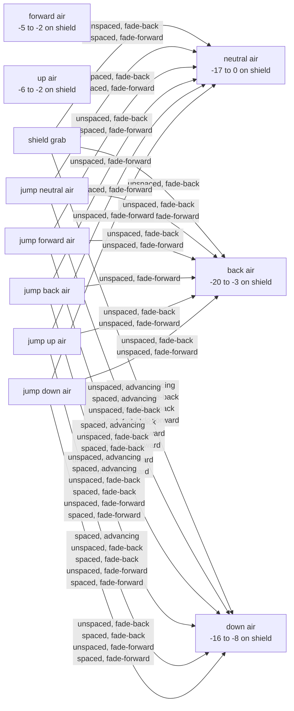
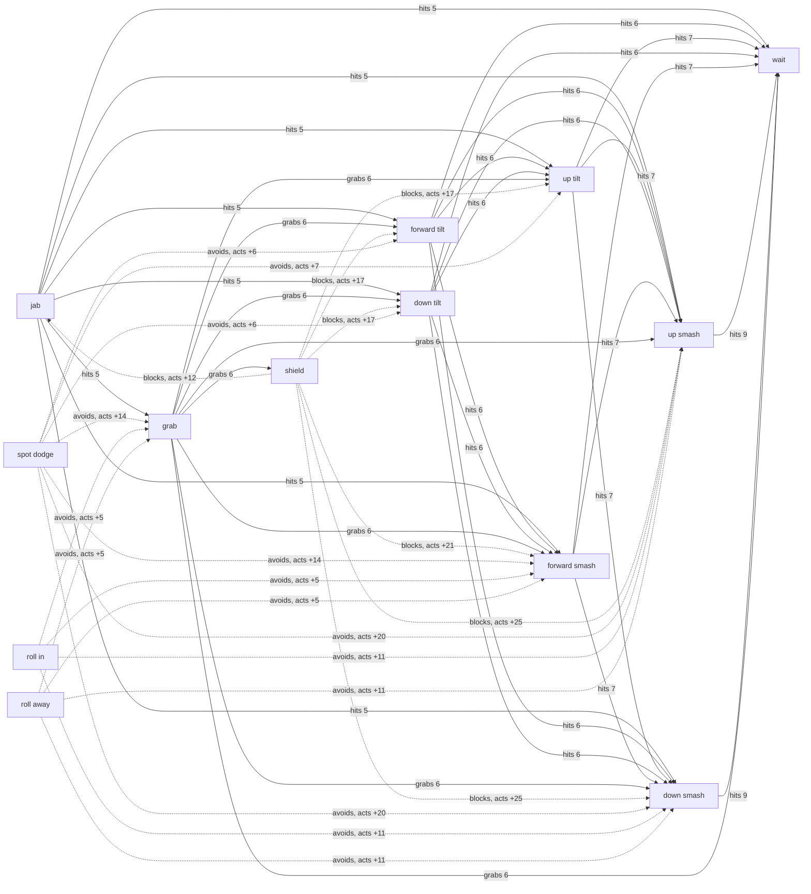
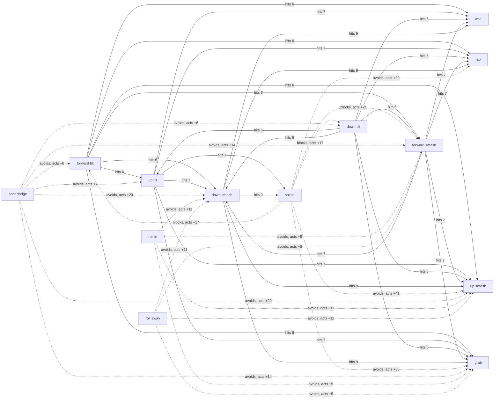
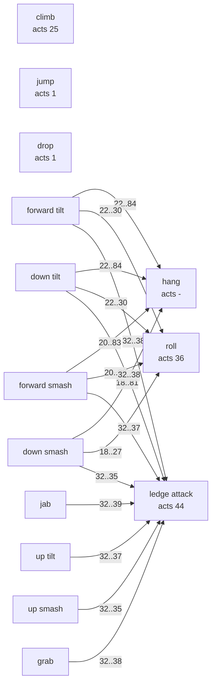
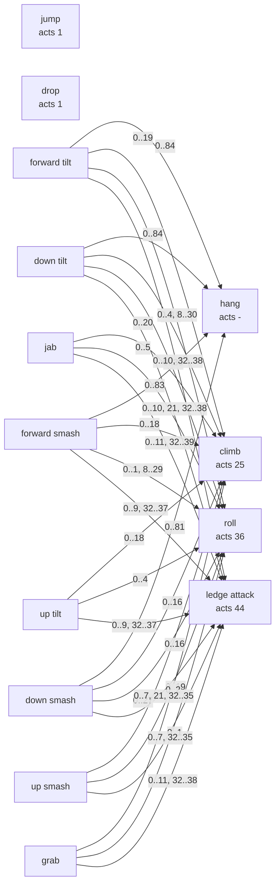

# Illidan: interaction graph

Generated by `bun wisp interactions` (smashcraft:ts/scripts/interactions.ts) from the match frame executor and the authored move data; do not edit. The model, its conditions and how to read it: [the interaction graph](../../../docs/design/interaction-graph.md). Illidan against Illidan on the flat stage; frames are match frames, 60 a second; distances are world units.

## Aerial on shield

Illidan short hops at a shielding Illidan from a standing start, approaching until the aerial meets the shield. Advancing presses the aerial as late in the hop as still meets the shield and holds no stick after; fade-back and fade-forward press it as early as meets the shield, then hold away or on through for the rest of the fall. Unspaced starts from the nearest distance that reaches the shield, spaced from the farthest. Frame 0 is the frame the aerial meets the shield; the other frames count from it. Advantage is the defender's first action minus the attacker's: negative means the defender acts first. Punish start frames are when the defender's option can start and still land before the attacker can act.

### Start distances that reach the shield

| Aerial | Start distances |
| --- | --- |
| neutral air | 48..210 |
| forward air | 48..270 |
| back air | 48..270 |
| up air | 48..150 |
| down air | 48..90 |

### Frame advantage and punishes

| Aerial | Spacing | Drift | Start | Hit at | Separation | Shieldstun | Attacker acts | Defender acts | Advantage | Punished by (start frames) |
| --- | --- | --- | --- | --- | --- | --- | --- | --- | --- | --- |
| neutral air | unspaced | advancing | 48 | 22 + 3 | -39.66 | 5 | 10 | 10 | 0 | safe |
| neutral air | spaced | advancing | 210 | 22 + 3 | 122.34 | 5 | 10 | 10 | 0 | safe |
| neutral air | unspaced | fade-back | 48 | 4 + 3 | 45.3 | 5 | 27 | 10 | -17 | shield grab 10..15; jump neutral air 10..18; jump forward air 10..18 |
| neutral air | spaced | fade-back | 210 | 16 + 9 | 122.34 | 5 | 10 | 10 | 0 | safe |
| neutral air | unspaced | fade-forward | 48 | 4 + 3 | 45.3 | 5 | 27 | 10 | -17 | shield grab 10..13; jump neutral air 10..20; jump forward air 10..18; jump back air 10..20; jump up air 10..18; jump down air 10..16 |
| neutral air | spaced | fade-forward | 210 | 16 + 9 | 122.34 | 5 | 10 | 10 | 0 | safe |
| forward air | unspaced | advancing | 48 | 20 + 5 | -39.78 | 5 | 12 | 10 | -2 | safe |
| forward air | spaced | advancing | 270 | 20 + 5 | 182.22 | 5 | 12 | 10 | -2 | safe |
| forward air | unspaced | fade-back | 48 | 17 + 5 | -23.94 | 5 | 15 | 10 | -5 | safe |
| forward air | spaced | fade-back | 270 | 19 + 6 | 182.22 | 5 | 12 | 10 | -2 | safe |
| forward air | unspaced | fade-forward | 48 | 17 + 5 | -23.94 | 5 | 15 | 10 | -5 | safe |
| forward air | spaced | fade-forward | 270 | 19 + 6 | 182.22 | 5 | 12 | 10 | -2 | safe |
| back air | unspaced | advancing | 48 | 22 + 3 | -39.78 | 5 | 13 | 10 | -3 | safe |
| back air | spaced | advancing | 270 | 22 + 3 | 182.22 | 5 | 13 | 10 | -3 | safe |
| back air | unspaced | fade-back | 48 | 4 + 3 | 43.5 | 5 | 30 | 10 | -20 | shield grab 10..24; jump neutral air 10..23; jump forward air 10..21; jump up air 10..13; jump down air 10..12 |
| back air | spaced | fade-back | 270 | 7 + 18 | 182.22 | 5 | 13 | 10 | -3 | safe |
| back air | unspaced | fade-forward | 48 | 4 + 3 | 43.5 | 5 | 30 | 10 | -20 | jump neutral air 10..23; jump forward air 10..11; jump back air 10..23; jump up air 10..17; jump down air 10..18 |
| back air | spaced | fade-forward | 270 | 7 + 18 | 182.22 | 5 | 13 | 10 | -3 | safe |
| up air | unspaced | advancing | 48 | 20 + 5 | -39.78 | 5 | 12 | 10 | -2 | safe |
| up air | spaced | advancing | 150 | 20 + 5 | 62.22 | 5 | 12 | 10 | -2 | safe |
| up air | unspaced | fade-back | 48 | 16 + 5 | -18.66 | 5 | 16 | 10 | -6 | safe |
| up air | spaced | fade-back | 150 | 18 + 7 | 62.22 | 5 | 12 | 10 | -2 | safe |
| up air | unspaced | fade-forward | 48 | 16 + 5 | -18.66 | 5 | 16 | 10 | -6 | safe |
| up air | spaced | fade-forward | 150 | 18 + 7 | 62.22 | 5 | 12 | 10 | -2 | safe |
| down air | unspaced | advancing | 48 | 13 + 7 | -13.38 | 6 | 20 | 12 | -8 | jump neutral air 12..13; jump back air 12..13 |
| down air | spaced | advancing | 90 | 12 + 7 | 33.9 | 6 | 21 | 12 | -9 | shield grab 12..15; jump neutral air 12..14; jump forward air 12; jump back air 12..14; jump up air 12 |
| down air | unspaced | fade-back | 48 | 4 + 7 | 31.8 | 6 | 28 | 12 | -16 | shield grab 12..22; jump neutral air 12..21; jump forward air 12..19; jump back air 12..14; jump up air 12..19; jump down air 12..17 |
| down air | spaced | fade-back | 90 | 9 + 7 | 49.74 | 6 | 24 | 12 | -12 | shield grab 12..18; jump neutral air 12..17; jump forward air 12..15; jump back air 12..15; jump up air 12..15; jump down air 12..13 |
| down air | unspaced | fade-forward | 48 | 4 + 7 | 31.8 | 6 | 28 | 12 | -16 | jump neutral air 12..21; jump forward air 12..17; jump back air 12..21; jump up air 12..19; jump down air 12..17 |
| down air | spaced | fade-forward | 90 | 9 + 7 | 49.74 | 6 | 24 | 12 | -12 | shield grab 12..14; jump neutral air 12..17; jump forward air 12..15; jump back air 12..17; jump up air 12..15; jump down air 12..13 |

### Out of shield, and the attacker's punishes

Each cell: the frame the defender's option lets it act again, then the attacker's ground options that land before that, with their start frames; or, when the option lands on an attacker who waits, that contact.

| Aerial | Spacing | Drift | shield grab | spot dodge | roll in | roll away |
| --- | --- | --- | --- | --- | --- | --- |
| neutral air | unspaced | advancing | acts 46: forward tilt 10..40; down tilt 10..40; forward smash 10..39; down smash 10..37 | acts 32: forward tilt 19..26; down tilt 19..26; forward smash 17..25; down smash 15..23 | acts 41: jab 24..36; forward tilt 23..35; up tilt 22..34; down tilt 23..35; forward smash 21..34; up smash 19..32; down smash 19..32; grab 23..35 | acts 41: forward smash 21..34 |
| neutral air | spaced | advancing | acts 46: forward tilt 10..40; up tilt 10..39; down tilt 10..40; forward smash 10..39; down smash 10..37 | acts 32: forward tilt 19..26; up tilt 18..25; down tilt 19..26; forward smash 17..25; down smash 15..23 | acts 41: jab 24..36; forward tilt 23..35; up tilt 22..34; down tilt 23..35; forward smash 27..34; up smash 19..32; down smash 19..32 | acts 41: safe |
| neutral air | unspaced | fade-back | lands on a waiting attacker: W 15 grab | acts 32: safe | acts 41: jab 27..36; forward tilt 27..35; up tilt 27..34; down tilt 27..35; forward smash 27..34; up smash 27..32; down smash 27..32; grab 27..35 | acts 41: safe |
| neutral air | spaced | fade-back | acts 46: forward tilt 10..40; up tilt 10..39; down tilt 10..40; forward smash 10..39; down smash 10..37 | acts 32: forward tilt 19..26; up tilt 18..25; down tilt 19..26; forward smash 17..25; down smash 15..23 | acts 41: jab 24..36; forward tilt 23..35; up tilt 22..34; down tilt 23..35; forward smash 27..34; up smash 19..32; down smash 19..32 | acts 41: safe |
| neutral air | unspaced | fade-forward | lands on a waiting attacker: W 15 grab | acts 32: safe | acts 41: forward smash 27..34 | acts 41: jab 27..36; forward tilt 27..35; up tilt 27..34; down tilt 27..35; forward smash 27..34; up smash 27..32; down smash 27..32; grab 27..35 |
| neutral air | spaced | fade-forward | acts 46: forward tilt 10..40; up tilt 10..39; down tilt 10..40; forward smash 10..39; down smash 10..37 | acts 32: forward tilt 19..26; up tilt 18..25; down tilt 19..26; forward smash 17..25; down smash 15..23 | acts 41: jab 24..36; forward tilt 23..35; up tilt 22..34; down tilt 23..35; forward smash 27..34; up smash 19..32; down smash 19..32 | acts 41: safe |
| forward air | unspaced | advancing | acts 46: forward tilt 12..40; up tilt 12..39; down tilt 12..40; forward smash 12..39; up smash 12..37; down smash 12..37 | acts 32: forward tilt 19..26; up tilt 18..25; down tilt 19..26; forward smash 17..25; up smash 15..23; down smash 15..23 | acts 41: jab 24..36; forward tilt 23..35; up tilt 22..34; down tilt 23..35; forward smash 21..34; up smash 19..32; down smash 19..32; grab 23..35 | acts 41: forward smash 21..34 |
| forward air | spaced | advancing | acts 46: forward smash 12..39 | acts 32: forward smash 17..25 | acts 41: jab 24..36; forward tilt 23..35; up tilt 22..34; down tilt 23..35; forward smash 21..34; up smash 19..32; down smash 19..32; grab 23..35 | acts 41: safe |
| forward air | unspaced | fade-back | acts 46: jab 15..41; forward tilt 15..40; up tilt 15..39; down tilt 15..40; forward smash 15..39; up smash 15..37; down smash 15..37 | acts 32: jab 20..27; forward tilt 19..26; up tilt 18..25; down tilt 19..26; forward smash 17..25; up smash 15..23; down smash 15..23 | acts 41: jab 24..36; forward tilt 23..35; up tilt 22..34; down tilt 23..35; forward smash 21..34; up smash 19..32; down smash 19..32; grab 23..35 | acts 41: forward smash 21..34 |
| forward air | spaced | fade-back | acts 46: forward smash 12..39 | acts 32: forward smash 17..25 | acts 41: jab 24..36; forward tilt 23..35; up tilt 22..34; down tilt 23..35; forward smash 21..34; up smash 19..32; down smash 19..32; grab 23..35 | acts 41: safe |
| forward air | unspaced | fade-forward | acts 46: forward tilt 15..40; up tilt 15..39; down tilt 15..40; forward smash 15..39; up smash 15..37; down smash 15..37 | acts 32: forward tilt 19..26; up tilt 18..25; down tilt 19..26; forward smash 17..25; up smash 15..23; down smash 15..23 | acts 41: jab 24..36; forward tilt 23..35; up tilt 22..34; down tilt 23..35; forward smash 21..34; up smash 19..32; down smash 19..32; grab 23..35 | acts 41: forward smash 21..34 |
| forward air | spaced | fade-forward | acts 46: forward smash 12..39 | acts 32: forward smash 17..25 | acts 41: jab 24..36; forward tilt 23..35; up tilt 22..34; down tilt 23..35; forward smash 21..34; up smash 19..32; down smash 19..32; grab 23..35 | acts 41: safe |
| back air | unspaced | advancing | acts 46: jab 13..41; forward tilt 13..40; up tilt 13..39; down tilt 13..40; forward smash 13..39; up smash 13..37; down smash 13..37; grab 13..40 | acts 32: jab 20..27; forward tilt 19..26; up tilt 18..25; down tilt 19..26; forward smash 17..25; up smash 15..23; down smash 15..23; grab 19..26 | acts 41: forward tilt 24..35; up tilt 22..34; down tilt 23..35; forward smash 24..34; up smash 19..32; down smash 19..32 | acts 41: safe |
| back air | spaced | advancing | acts 46: forward tilt 13; down tilt 13..40; forward smash 13..39 | acts 32: down tilt 19..26; forward smash 17..25 | acts 41: jab 24..36; forward tilt 23..35; up tilt 22..34; down tilt 23..35; forward smash 21..34; up smash 19..32; down smash 19..32 | acts 41: safe |
| back air | unspaced | fade-back | lands on a waiting attacker: W 15 grab | acts 32: safe | acts 41: jab 30..36; forward tilt 30..35; up tilt 30..34; down tilt 30..35; forward smash 30..34; up smash 30..32; down smash 30..32; grab 30..35 | acts 41: safe |
| back air | spaced | fade-back | acts 46: forward smash 13..39 | acts 32: forward smash 17..25 | acts 41: jab 24..36; forward tilt 23..35; up tilt 22..34; down tilt 23..35; forward smash 21..34; up smash 19..32; down smash 19..32 | acts 41: safe |
| back air | unspaced | fade-forward | acts 46: jab 30..41; forward tilt 30..40; up tilt 30..39; down tilt 30..40; forward smash 30..39; up smash 30..37; down smash 30..37; grab 30..40 | acts 32: safe | acts 41: safe | acts 41: forward tilt 30..35; up tilt 30..34; down tilt 30..35; forward smash 30..34; up smash 30..32; down smash 30..32 |
| back air | spaced | fade-forward | acts 46: forward tilt 13..15; down tilt 13..40; forward smash 13..39 | acts 32: down tilt 19..26; forward smash 17..25 | acts 41: jab 24..36; forward tilt 23..35; up tilt 22..34; down tilt 23..35; forward smash 21..34; up smash 19..32; down smash 19..32 | acts 41: safe |
| up air | unspaced | advancing | acts 46: forward tilt 12..40; up tilt 12..39; down tilt 12..40; forward smash 12..39; up smash 12..37; down smash 12..37 | acts 32: forward tilt 19..26; up tilt 18..25; down tilt 19..26; forward smash 17..25; up smash 15..23; down smash 15..23 | acts 41: jab 24..36; forward tilt 23..35; up tilt 22..34; down tilt 23..35; forward smash 21..34; up smash 19..32; down smash 19..32; grab 23..35 | acts 41: forward smash 21..34 |
| up air | spaced | advancing | lands on a waiting attacker: W 15 grab | acts 32: jab 20..27; forward tilt 19..26; up tilt 18..25; down tilt 19..26; forward smash 17..25; up smash 15..23; down smash 15..23; grab 19..26 | acts 41: forward tilt 23..35; down tilt 23..35; forward smash 21..34; down smash 19..32 | acts 41: forward smash 21..34 |
| up air | unspaced | fade-back | acts 46: jab 16..41; forward tilt 16..40; up tilt 16..39; down tilt 16..40; forward smash 16..39; up smash 16..37; down smash 16..37 | acts 32: jab 20..27; forward tilt 19..26; up tilt 18..25; down tilt 19..26; forward smash 17..25; up smash 16..23; down smash 16..23 | acts 41: jab 24..36; forward tilt 23..35; up tilt 22..34; down tilt 23..35; forward smash 21..34; up smash 19..32; down smash 19..32 | acts 41: forward smash 21..34 |
| up air | spaced | fade-back | lands on a waiting attacker: W 15 grab | acts 32: jab 20..27; forward tilt 19..26; up tilt 18..25; down tilt 19..26; forward smash 17..25; up smash 15..23; down smash 15..23; grab 19..26 | acts 41: forward tilt 23..35; down tilt 23..35; forward smash 21..34; down smash 19..32 | acts 41: forward smash 21..34 |
| up air | unspaced | fade-forward | acts 46: forward tilt 16..40; up tilt 16..39; down tilt 16..40; forward smash 16..39; up smash 16..37; down smash 16..37 | acts 32: forward tilt 19..26; up tilt 18..25; down tilt 19..26; forward smash 17..25; up smash 16..23; down smash 16..23 | acts 41: jab 24..36; forward tilt 23..35; up tilt 22..34; down tilt 23..35; forward smash 21..34; up smash 19..32; down smash 19..32; grab 23..35 | acts 41: forward smash 21..34 |
| up air | spaced | fade-forward | lands on a waiting attacker: W 15 grab | acts 32: jab 20..27; forward tilt 19..26; up tilt 18..25; down tilt 19..26; forward smash 17..25; up smash 15..23; down smash 15..23; grab 19..26 | acts 41: forward tilt 23..35; down tilt 23..35; forward smash 21..34; down smash 19..32 | acts 41: forward smash 21..34 |
| down air | unspaced | advancing | acts 48: forward tilt 20..42; up tilt 20..41; down tilt 20..42; forward smash 20..41; up smash 20..39; down smash 20..39 | acts 34: forward tilt 21..28; up tilt 20..27; down tilt 21..28; forward smash 20..27; up smash 20..25; down smash 20..25 | acts 43: jab 26..38; forward tilt 25..37; up tilt 24..36; down tilt 25..37; forward smash 23..36; up smash 21..34; down smash 21..34; grab 25..37 | acts 43: forward smash 23..36 |
| down air | spaced | advancing | lands on a waiting attacker: W 17 grab | acts 34: jab 22..29; forward tilt 21..28; up tilt 21..27; down tilt 21..28; forward smash 21..27; up smash 21..25; down smash 21..25; grab 21..28 | acts 43: forward tilt 25..37; down tilt 25..37; forward smash 23..36; down smash 21..34 | acts 43: forward tilt 25..37; down tilt 25..37; forward smash 23..36 |
| down air | unspaced | fade-back | lands on a waiting attacker: W 17 grab | acts 34: jab 28..29; forward tilt 28; down tilt 28; grab 28 | acts 43: forward tilt 28..37; down tilt 28..37; forward smash 28..36; down smash 28..34 | acts 43: forward smash 28..36 |
| down air | spaced | fade-back | lands on a waiting attacker: W 17 grab | acts 34: jab 24..29; forward tilt 24..28; up tilt 24..27; down tilt 24..28; forward smash 24..27; up smash 24..25; down smash 24..25; grab 24..28 | acts 43: forward tilt 25..37; down tilt 25..37; forward smash 24..36; down smash 24..34 | acts 43: forward smash 24..36 |
| down air | unspaced | fade-forward | acts 48: forward tilt 28..42; up tilt 28..41; down tilt 28..42; forward smash 28..41; up smash 28..39; down smash 28..39 | acts 34: forward tilt 28; down tilt 28 | acts 43: forward smash 28..36 | acts 43: jab 28..38; forward tilt 28..37; up tilt 28..36; down tilt 28..37; forward smash 28..36; up smash 28..34; down smash 28..34; grab 28..37 |
| down air | spaced | fade-forward | lands on a waiting attacker: W 17 grab | acts 34: jab 24..29; forward tilt 24..28; up tilt 24..27; down tilt 24..28; forward smash 24..27; up smash 24..25; down smash 24..25 | acts 43: down tilt 25..37; forward smash 24..36 | acts 43: forward tilt 25..37; up tilt 24..36; down tilt 25..37; forward smash 24..36; down smash 24..34 |

### Follow-ups: the defender's options against the attacker's

Rows are the defender's options, columns the attacker's, each from the first frame it can start. W/L: the row lands first (W) or is hit first (L) on that frame; T: both on one frame; a signed number: neither lands and the row can act that many frames before (+) or after (-) the column; (shield): an attack met a shield first.

neutral air, unspaced, advancing

|  | wait | jab | grab | shield | spot dodge | roll away |
| --- | --- | --- | --- | --- | --- | --- |
| hold shield | 0 | +21 | +36 | +1 | +22 | +31 |
| shield grab | -36 | -15 | 0 | -35 | -14 | -5 |
| jump neutral air | W 16 | W 16 | W 16 | -17 (shield) | W 25 | W 30 |
| jump forward air | -32 | -11 | +4 | -31 | -10 | -1 |
| jump back air | W 16 | W 16 | W 16 | -20 (shield) | W 25 | W 29 |
| jump up air | W 18 | W 18 | W 18 | W 18 | -10 | -1 |
| jump down air | W 20 | W 20 | W 20 | -16 (shield) | -12 | -3 |
| spot dodge | -22 | -1 | +14 | -21 | 0 | +9 |
| roll in | -31 | -10 | +5 | -30 | -9 | 0 |
| roll away | -31 | -10 | +5 | -30 | -9 | 0 |

neutral air, spaced, advancing

|  | wait | jab | grab | shield | spot dodge | roll away |
| --- | --- | --- | --- | --- | --- | --- |
| hold shield | 0 | +12 (shield) | +36 | +1 | +22 | +31 |
| shield grab | -36 | -15 | 0 | -35 | -14 | -5 |
| jump neutral air | W 16 | W 16 | W 16 | W 16 | W 25 | +1 |
| jump forward air | W 18 | W 18 | W 18 | W 18 | -10 | -1 |
| jump back air | -33 | -12 | +3 | -32 | -11 | -2 |
| jump up air | -32 | -11 | +4 | -31 | -10 | -1 |
| jump down air | -34 | -13 | +2 | -33 | -12 | -3 |
| spot dodge | -22 | -1 | +14 | -21 | 0 | +9 |
| roll in | -31 | -10 | +5 | -30 | -9 | 0 |
| roll away | -31 | -10 | +5 | -30 | -9 | 0 |

neutral air, unspaced, fade-back

|  | wait | jab | grab | shield | spot dodge | roll away |
| --- | --- | --- | --- | --- | --- | --- |
| hold shield | +17 | +38 | +53 | +18 | +39 | +48 |
| shield grab | W 15 grab | W 15 grab | W 15 grab | W 15 grab | W 15 grab | W 15 grab |
| jump neutral air | W 16 | W 16 | W 16 | W 16 | W 16 | W 16 |
| jump forward air | W 18 | W 18 | W 18 | W 18 | W 18 | W 18 |
| jump back air | -16 | L 31 | L 32 grab | -15 | +6 | +15 |
| jump up air | -15 | L 31 | L 32 grab | -14 | +7 | +16 |
| jump down air | -17 | L 31 | L 32 grab | -16 | +5 | +14 |
| spot dodge | -5 | +16 | +31 | -4 | +17 | +26 |
| roll in | -14 | L 31 | L 32 grab | -13 | +8 | +17 |
| roll away | -14 | +7 | +22 | -13 | +8 | +17 |

neutral air, spaced, fade-back

|  | wait | jab | grab | shield | spot dodge | roll away |
| --- | --- | --- | --- | --- | --- | --- |
| hold shield | 0 | +21 | +36 | +1 | +22 | +31 |
| shield grab | -36 | -15 | 0 | -35 | -14 | -5 |
| jump neutral air | W 16 | W 16 | W 16 | W 16 | W 25 | +1 |
| jump forward air | W 18 | W 18 | W 18 | W 18 | -10 | -1 |
| jump back air | -33 | -12 | +3 | -32 | -11 | -2 |
| jump up air | -32 | -11 | +4 | -31 | -10 | -1 |
| jump down air | -34 | -13 | +2 | -33 | -12 | -3 |
| spot dodge | -22 | -1 | +14 | -21 | 0 | +9 |
| roll in | -31 | -10 | +5 | -30 | -9 | 0 |
| roll away | -31 | -10 | +5 | -30 | -9 | 0 |

neutral air, unspaced, fade-forward

|  | wait | jab | grab | shield | spot dodge | roll away |
| --- | --- | --- | --- | --- | --- | --- |
| hold shield | +17 | +38 | +53 | +18 | +39 | +48 |
| shield grab | W 15 grab | W 15 grab | W 15 grab | W 15 grab | W 15 grab | W 15 grab |
| jump neutral air | W 16 | W 16 | W 16 | W 16 | W 16 | W 16 |
| jump forward air | W 18 | W 18 | W 18 | W 18 | W 18 | W 18 |
| jump back air | W 16 | W 16 | W 16 | W 16 | W 16 | W 16 |
| jump up air | W 18 | W 18 | W 18 | W 18 | W 18 | W 18 |
| jump down air | W 20 | W 20 | W 20 | W 20 | W 20 | W 20 |
| spot dodge | -5 | +16 | +31 | -4 | +17 | +26 |
| roll in | -14 | +7 | +22 | -13 | +8 | +17 |
| roll away | -14 | L 31 | L 32 grab | -13 | +8 | +17 |

neutral air, spaced, fade-forward

|  | wait | jab | grab | shield | spot dodge | roll away |
| --- | --- | --- | --- | --- | --- | --- |
| hold shield | 0 | +12 (shield) | +36 | +1 | +22 | +31 |
| shield grab | -36 | -15 | 0 | -35 | -14 | -5 |
| jump neutral air | W 16 | L 15 | W 16 | W 16 | W 25 | +1 |
| jump forward air | W 18 | L 15 | W 18 | W 18 | -10 | -1 |
| jump back air | -33 | L 15 | +3 | -32 | -11 | -2 |
| jump up air | -32 | L 15 | +4 | -31 | -10 | -1 |
| jump down air | -34 | L 15 | +2 | -33 | -12 | -3 |
| spot dodge | -22 | -1 | +14 | -21 | 0 | +9 |
| roll in | -31 | -10 | +5 | -30 | -9 | 0 |
| roll away | -31 | -10 | +5 | -30 | -9 | 0 |

forward air, unspaced, advancing

|  | wait | jab | grab | shield | spot dodge | roll away |
| --- | --- | --- | --- | --- | --- | --- |
| hold shield | +2 | +23 | +38 | +3 | +24 | +33 |
| shield grab | -34 | -13 | +2 | -33 | -12 | -3 |
| jump neutral air | W 16 | W 16 | W 16 | -17 (shield) | W 27 | W 31 |
| jump forward air | -30 | -9 | +6 | -29 | -8 | +1 |
| jump back air | W 16 | W 16 | W 16 | -20 (shield) | W 27 | W 31 |
| jump up air | W 18 | W 18 | W 18 | W 18 | -8 | +1 |
| jump down air | W 20 | W 20 | W 20 | -16 (shield) | -10 | -1 |
| spot dodge | -20 | +1 | +16 | -19 | +2 | +11 |
| roll in | -29 | -8 | +7 | -28 | -7 | +2 |
| roll away | -29 | -8 | +7 | -28 | -7 | +2 |

forward air, spaced, advancing

|  | wait | jab | grab | shield | spot dodge | roll away |
| --- | --- | --- | --- | --- | --- | --- |
| hold shield | +2 | +23 | +38 | +3 | +24 | +33 |
| shield grab | -34 | -13 | +2 | -33 | -12 | -3 |
| jump neutral air | W 29 | W 29 | W 29 | W 29 | W 30 | +3 |
| jump forward air | W 18 | W 18 | W 18 | W 18 | -8 | +1 |
| jump back air | -31 | -10 | +5 | -30 | -9 | 0 |
| jump up air | -30 | -9 | +6 | -29 | -8 | +1 |
| jump down air | -32 | -11 | +4 | -31 | -10 | -1 |
| spot dodge | -20 | +1 | +16 | -19 | +2 | +11 |
| roll in | -29 | -8 | +7 | -28 | -7 | +2 |
| roll away | -29 | -8 | +7 | -28 | -7 | +2 |

forward air, unspaced, fade-back

|  | wait | jab | grab | shield | spot dodge | roll away |
| --- | --- | --- | --- | --- | --- | --- |
| hold shield | +5 | +12 (shield) | +41 | +6 | +27 | +36 |
| shield grab | -31 | L 19 | +5 | -30 | -9 | 0 |
| jump neutral air | W 16 | W 16 | W 16 | -17 (shield) | W 30 | W 16 |
| jump forward air | W 18 | W 18 | W 18 | W 18 | -5 | +4 |
| jump back air | W 16 | W 16 | W 16 | -20 (shield) | W 30 | W 16 |
| jump up air | W 18 | W 18 | W 18 | W 18 | -5 | +4 |
| jump down air | W 20 | L 19 | W 20 | -16 (shield) | -7 | +2 |
| spot dodge | -17 | +4 | +19 | -16 | +5 | +14 |
| roll in | -26 | -5 | +10 | -25 | -4 | +5 |
| roll away | -26 | -5 | +10 | -25 | -4 | +5 |

forward air, spaced, fade-back

|  | wait | jab | grab | shield | spot dodge | roll away |
| --- | --- | --- | --- | --- | --- | --- |
| hold shield | +2 | +23 | +38 | +3 | +24 | +33 |
| shield grab | -34 | -13 | +2 | -33 | -12 | -3 |
| jump neutral air | W 30 | W 30 | W 30 | W 30 | W 30 | +3 |
| jump forward air | W 18 | W 18 | W 18 | W 18 | -8 | +1 |
| jump back air | -31 | -10 | +5 | -30 | -9 | 0 |
| jump up air | -30 | -9 | +6 | -29 | -8 | +1 |
| jump down air | -32 | -11 | +4 | -31 | -10 | -1 |
| spot dodge | -20 | +1 | +16 | -19 | +2 | +11 |
| roll in | -29 | -8 | +7 | -28 | -7 | +2 |
| roll away | -29 | -8 | +7 | -28 | -7 | +2 |

forward air, unspaced, fade-forward

|  | wait | jab | grab | shield | spot dodge | roll away |
| --- | --- | --- | --- | --- | --- | --- |
| hold shield | +5 | +26 | +41 | +6 | +27 | +36 |
| shield grab | -31 | -10 | +5 | -30 | -9 | 0 |
| jump neutral air | W 16 | W 16 | W 16 | -17 (shield) | W 30 | W 16 |
| jump forward air | -27 | -6 | +9 | -26 | -5 | +4 |
| jump back air | W 16 | W 16 | W 16 | -20 (shield) | W 30 | W 16 |
| jump up air | W 18 | W 18 | W 18 | W 18 | -5 | +4 |
| jump down air | W 20 | W 20 | W 20 | -16 (shield) | -7 | +2 |
| spot dodge | -17 | +4 | +19 | -16 | +5 | +14 |
| roll in | -26 | -5 | +10 | -25 | -4 | +5 |
| roll away | -26 | -5 | +10 | -25 | -4 | +5 |

forward air, spaced, fade-forward

|  | wait | jab | grab | shield | spot dodge | roll away |
| --- | --- | --- | --- | --- | --- | --- |
| hold shield | +2 | +23 | +38 | +3 | +24 | +33 |
| shield grab | -34 | -13 | +2 | -33 | -12 | -3 |
| jump neutral air | W 29 | W 29 | W 29 | W 29 | W 30 | +3 |
| jump forward air | W 18 | W 18 | W 18 | W 18 | -8 | +1 |
| jump back air | -31 | -10 | +5 | -30 | -9 | 0 |
| jump up air | -30 | -9 | +6 | -29 | -8 | +1 |
| jump down air | -32 | -11 | +4 | -31 | -10 | -1 |
| spot dodge | -20 | +1 | +16 | -19 | +2 | +11 |
| roll in | -29 | -8 | +7 | -28 | -7 | +2 |
| roll away | -29 | -8 | +7 | -28 | -7 | +2 |

back air, unspaced, advancing

|  | wait | jab | grab | shield | spot dodge | roll away |
| --- | --- | --- | --- | --- | --- | --- |
| hold shield | +3 | +12 (shield) | L 18 grab | +4 | +25 | +34 |
| shield grab | -33 | L 17 | L 18 grab | -32 | -11 | -2 |
| jump neutral air | W 16 | W 16 | W 16 | -17 (shield) | W 28 | +4 |
| jump forward air | -29 | L 17 | L 18 grab | -28 | -7 | +2 |
| jump back air | W 16 | W 16 | W 16 | -20 (shield) | W 28 | +1 |
| jump up air | -29 | L 17 | L 18 grab | -28 | -7 | +2 |
| jump down air | W 22 | L 17 | L 18 grab | W 22 | -9 | 0 |
| spot dodge | -19 | +2 | +17 | -18 | +3 | +12 |
| roll in | -28 | -7 | +8 | -27 | -6 | +3 |
| roll away | -28 | -7 | +8 | -27 | -6 | +3 |

back air, spaced, advancing

|  | wait | jab | grab | shield | spot dodge | roll away |
| --- | --- | --- | --- | --- | --- | --- |
| hold shield | +3 | +24 | +39 | +4 | +25 | +34 |
| shield grab | -33 | -12 | +3 | -32 | -11 | -2 |
| jump neutral air | W 24 | W 24 | W 24 | W 24 | W 28 | +4 |
| jump forward air | W 18 | W 18 | W 18 | W 18 | -7 | +2 |
| jump back air | -30 | -9 | +6 | -29 | -8 | +1 |
| jump up air | -29 | -8 | +7 | -28 | -7 | +2 |
| jump down air | -31 | -10 | +5 | -30 | -9 | 0 |
| spot dodge | -19 | +2 | +17 | -18 | +3 | +12 |
| roll in | -28 | -7 | +8 | -27 | -6 | +3 |
| roll away | -28 | -7 | +8 | -27 | -6 | +3 |

back air, unspaced, fade-back

|  | wait | jab | grab | shield | spot dodge | roll away |
| --- | --- | --- | --- | --- | --- | --- |
| hold shield | +20 | +41 | +56 | +21 | +42 | +51 |
| shield grab | W 15 grab | W 15 grab | W 15 grab | W 15 grab | W 15 grab | W 15 grab |
| jump neutral air | W 16 | W 16 | W 16 | W 16 | W 16 | W 16 |
| jump forward air | W 18 | W 18 | W 18 | W 18 | W 18 | W 18 |
| jump back air | W 31 | W 31 | W 31 | W 31 | W 30 | W 30 |
| jump up air | W 18 | W 18 | W 18 | W 18 | W 18 | W 18 |
| jump down air | W 20 | W 20 | W 20 | W 20 | W 20 | W 20 |
| spot dodge | -2 | +19 | +34 | -1 | +20 | +29 |
| roll in | -11 | L 34 | L 35 grab | -10 | +11 | +20 |
| roll away | -11 | +10 | +25 | -10 | +11 | +20 |

back air, spaced, fade-back

|  | wait | jab | grab | shield | spot dodge | roll away |
| --- | --- | --- | --- | --- | --- | --- |
| hold shield | +3 | +24 | +39 | +4 | +25 | +34 |
| shield grab | -33 | -12 | +3 | -32 | -11 | -2 |
| jump neutral air | W 24 | W 24 | W 24 | W 24 | W 28 | +4 |
| jump forward air | W 18 | W 18 | W 18 | W 18 | -7 | +2 |
| jump back air | -30 | -9 | +6 | -29 | -8 | +1 |
| jump up air | -29 | -8 | +7 | -28 | -7 | +2 |
| jump down air | -31 | -10 | +5 | -30 | -9 | 0 |
| spot dodge | -19 | +2 | +17 | -18 | +3 | +12 |
| roll in | -28 | -7 | +8 | -27 | -6 | +3 |
| roll away | -28 | -7 | +8 | -27 | -6 | +3 |

back air, unspaced, fade-forward

|  | wait | jab | grab | shield | spot dodge | roll away |
| --- | --- | --- | --- | --- | --- | --- |
| hold shield | +20 | +12 (shield) | L 35 grab | +21 | +42 | +51 |
| shield grab | -16 | L 34 | L 35 grab | -15 | +6 | +15 |
| jump neutral air | W 16 | W 16 | W 16 | W 16 | W 16 | W 16 |
| jump forward air | W 18 | W 18 | W 18 | W 18 | W 18 | W 18 |
| jump back air | W 16 | W 16 | W 16 | W 16 | W 16 | W 16 |
| jump up air | W 18 | W 18 | W 18 | W 18 | W 18 | W 18 |
| jump down air | W 20 | W 20 | W 20 | W 20 | W 20 | W 20 |
| spot dodge | -2 | L 34 | L 35 grab | -1 | +20 | +29 |
| roll in | -11 | +10 | +25 | -10 | +11 | +20 |
| roll away | -11 | +10 | +25 | -10 | +11 | +20 |

back air, spaced, fade-forward

|  | wait | jab | grab | shield | spot dodge | roll away |
| --- | --- | --- | --- | --- | --- | --- |
| hold shield | +3 | +24 | +39 | +4 | +25 | +34 |
| shield grab | -33 | -12 | +3 | -32 | -11 | -2 |
| jump neutral air | W 23 | W 23 | W 23 | W 23 | W 28 | +4 |
| jump forward air | W 18 | W 18 | W 18 | W 18 | -7 | +2 |
| jump back air | -30 | -9 | +6 | -29 | -8 | +1 |
| jump up air | -29 | -8 | +7 | -28 | -7 | +2 |
| jump down air | -31 | -10 | +5 | -30 | -9 | 0 |
| spot dodge | -19 | +2 | +17 | -18 | +3 | +12 |
| roll in | -28 | -7 | +8 | -27 | -6 | +3 |
| roll away | -28 | -7 | +8 | -27 | -6 | +3 |

up air, unspaced, advancing

|  | wait | jab | grab | shield | spot dodge | roll away |
| --- | --- | --- | --- | --- | --- | --- |
| hold shield | +2 | +23 | +38 | +3 | +24 | +33 |
| shield grab | -34 | -13 | +2 | -33 | -12 | -3 |
| jump neutral air | W 16 | W 16 | W 16 | -17 (shield) | W 27 | W 31 |
| jump forward air | -30 | -9 | +6 | -29 | -8 | +1 |
| jump back air | W 16 | W 16 | W 16 | -20 (shield) | W 27 | W 31 |
| jump up air | W 18 | W 18 | W 18 | W 18 | -8 | +1 |
| jump down air | W 20 | W 20 | W 20 | -16 (shield) | -10 | -1 |
| spot dodge | -20 | +1 | +16 | -19 | +2 | +11 |
| roll in | -29 | -8 | +7 | -28 | -7 | +2 |
| roll away | -29 | -8 | +7 | -28 | -7 | +2 |

up air, spaced, advancing

|  | wait | jab | grab | shield | spot dodge | roll away |
| --- | --- | --- | --- | --- | --- | --- |
| hold shield | +2 | +12 (shield) | L 17 grab | +3 | +24 | +33 |
| shield grab | W 15 grab | W 15 grab | W 15 grab | W 15 grab | -12 | -3 |
| jump neutral air | W 16 | T 16 | W 16 | -17 (shield) | W 27 | W 31 |
| jump forward air | W 18 | L 16 | L 17 grab | W 18 | -8 | +1 |
| jump back air | W 21 | L 16 | L 17 grab | W 21 | W 27 | 0 |
| jump up air | W 18 | L 16 | L 17 grab | W 18 | -8 | +1 |
| jump down air | W 20 | L 16 | L 17 grab | -16 (shield) | -10 | -1 |
| spot dodge | -20 | +1 | +16 | -19 | +2 | +11 |
| roll in | -29 | -8 | +7 | -28 | -7 | +2 |
| roll away | -29 | -8 | +7 | -28 | -7 | +2 |

up air, unspaced, fade-back

|  | wait | jab | grab | shield | spot dodge | roll away |
| --- | --- | --- | --- | --- | --- | --- |
| hold shield | +6 | +12 (shield) | +42 | +7 | +28 | +37 |
| shield grab | -30 | L 20 | +6 | -29 | -8 | +1 |
| jump neutral air | W 16 | W 16 | W 16 | -17 (shield) | W 16 | W 16 |
| jump forward air | W 18 | W 18 | W 18 | W 18 | -4 | W 18 |
| jump back air | W 16 | W 16 | W 16 | -20 (shield) | W 16 | W 16 |
| jump up air | W 18 | W 18 | W 18 | W 18 | -4 | W 18 |
| jump down air | W 20 | T 20 | W 20 | -16 (shield) | -6 | +3 |
| spot dodge | -16 | +5 | +20 | -15 | +6 | +15 |
| roll in | -25 | -4 | +11 | -24 | -3 | +6 |
| roll away | -25 | -4 | +11 | -24 | -3 | +6 |

up air, spaced, fade-back

|  | wait | jab | grab | shield | spot dodge | roll away |
| --- | --- | --- | --- | --- | --- | --- |
| hold shield | +2 | +12 (shield) | L 17 grab | +3 | +24 | +33 |
| shield grab | W 15 grab | W 15 grab | W 15 grab | W 15 grab | -12 | -3 |
| jump neutral air | W 16 | T 16 | W 16 | -17 (shield) | W 27 | W 32 |
| jump forward air | W 18 | L 16 | L 17 grab | W 18 | -8 | +1 |
| jump back air | W 22 | L 16 | L 17 grab | W 22 | W 27 | 0 |
| jump up air | W 18 | L 16 | L 17 grab | W 18 | -8 | +1 |
| jump down air | W 20 | L 16 | L 17 grab | -16 (shield) | -10 | -1 |
| spot dodge | -20 | +1 | +16 | -19 | +2 | +11 |
| roll in | -29 | -8 | +7 | -28 | -7 | +2 |
| roll away | -29 | -8 | +7 | -28 | -7 | +2 |

up air, unspaced, fade-forward

|  | wait | jab | grab | shield | spot dodge | roll away |
| --- | --- | --- | --- | --- | --- | --- |
| hold shield | +6 | +27 | +42 | +7 | +28 | +37 |
| shield grab | -30 | -9 | +6 | -29 | -8 | +1 |
| jump neutral air | W 16 | W 16 | W 16 | -17 (shield) | W 16 | W 16 |
| jump forward air | -26 | -5 | +10 | -25 | -4 | +5 |
| jump back air | W 16 | W 16 | W 16 | -20 (shield) | W 16 | W 16 |
| jump up air | W 18 | W 18 | W 18 | W 18 | -4 | W 18 |
| jump down air | W 20 | W 20 | W 20 | -16 (shield) | -6 | +3 |
| spot dodge | -16 | +5 | +20 | -15 | +6 | +15 |
| roll in | -25 | -4 | +11 | -24 | -3 | +6 |
| roll away | -25 | -4 | +11 | -24 | -3 | +6 |

up air, spaced, fade-forward

|  | wait | jab | grab | shield | spot dodge | roll away |
| --- | --- | --- | --- | --- | --- | --- |
| hold shield | +2 | +12 (shield) | L 17 grab | +3 | +24 | +33 |
| shield grab | W 15 grab | W 15 grab | W 15 grab | W 15 grab | -12 | -3 |
| jump neutral air | W 16 | T 16 | W 16 | -17 (shield) | W 27 | W 31 |
| jump forward air | W 18 | L 16 | L 17 grab | W 18 | -8 | +1 |
| jump back air | W 21 | L 16 | L 17 grab | W 21 | W 27 | 0 |
| jump up air | W 18 | L 16 | L 17 grab | W 18 | -8 | +1 |
| jump down air | W 20 | L 16 | L 17 grab | -16 (shield) | -10 | -1 |
| spot dodge | -20 | +1 | +16 | -19 | +2 | +11 |
| roll in | -29 | -8 | +7 | -28 | -7 | +2 |
| roll away | -29 | -8 | +7 | -28 | -7 | +2 |

down air, unspaced, advancing

|  | wait | jab | grab | shield | spot dodge | roll away |
| --- | --- | --- | --- | --- | --- | --- |
| hold shield | +8 | +29 | +44 | +9 | +30 | +39 |
| shield grab | -28 | -7 | +8 | -27 | -6 | +3 |
| jump neutral air | W 18 | W 18 | W 18 | W 18 | W 18 | W 18 |
| jump forward air | W 20 | W 20 | W 20 | W 20 | W 20 | W 20 |
| jump back air | W 18 | W 18 | W 18 | W 18 | W 18 | W 18 |
| jump up air | W 20 | W 20 | W 20 | W 20 | W 20 | W 20 |
| jump down air | W 22 | W 22 | W 22 | -16 (shield) | -4 | W 22 |
| spot dodge | -14 | +7 | +22 | -13 | +8 | +17 |
| roll in | -23 | -2 | +13 | -22 | -1 | +8 |
| roll away | -23 | -2 | +13 | -22 | -1 | +8 |

down air, spaced, advancing

|  | wait | jab | grab | shield | spot dodge | roll away |
| --- | --- | --- | --- | --- | --- | --- |
| hold shield | +9 | +12 (shield) | L 26 grab | +10 | +31 | +40 |
| shield grab | W 17 grab | W 17 grab | W 17 grab | W 17 grab | W 17 grab | W 17 grab |
| jump neutral air | W 18 | W 18 | W 18 | W 18 | W 18 | W 18 |
| jump forward air | W 20 | W 20 | W 20 | W 20 | W 20 | W 20 |
| jump back air | W 18 | W 18 | W 18 | W 18 | W 18 | W 18 |
| jump up air | W 20 | W 20 | W 20 | W 20 | W 20 | W 20 |
| jump down air | W 22 | W 22 | W 22 | -16 (shield) | -3 | W 22 |
| spot dodge | -13 | +8 | L 27 grab | -12 | +9 | +18 |
| roll in | -22 | -1 | +14 | -21 | 0 | +9 |
| roll away | -22 | -1 | +14 | -21 | 0 | +9 |

down air, unspaced, fade-back

|  | wait | jab | grab | shield | spot dodge | roll away |
| --- | --- | --- | --- | --- | --- | --- |
| hold shield | +16 | +12 (shield) | L 33 grab | +17 | +38 | +47 |
| shield grab | W 17 grab | W 17 grab | W 17 grab | W 17 grab | W 17 grab | W 17 grab |
| jump neutral air | W 18 | W 18 | W 18 | W 18 | W 18 | W 18 |
| jump forward air | W 20 | W 20 | W 20 | W 20 | W 20 | W 20 |
| jump back air | W 25 | W 25 | W 25 | W 25 | W 25 | W 25 |
| jump up air | W 20 | W 20 | W 20 | W 20 | W 20 | W 20 |
| jump down air | W 22 | W 22 | W 22 | W 22 | W 22 | W 22 |
| spot dodge | -6 | L 32 | L 33 grab | -5 | +16 | +25 |
| roll in | -15 | +6 | +21 | -14 | +7 | +16 |
| roll away | -15 | +6 | +21 | -14 | +7 | +16 |

down air, spaced, fade-back

|  | wait | jab | grab | shield | spot dodge | roll away |
| --- | --- | --- | --- | --- | --- | --- |
| hold shield | +12 | +12 (shield) | L 29 grab | +13 | +34 | +43 |
| shield grab | W 17 grab | W 17 grab | W 17 grab | W 17 grab | W 17 grab | W 17 grab |
| jump neutral air | W 18 | W 18 | W 18 | W 18 | W 18 | W 18 |
| jump forward air | W 20 | W 20 | W 20 | W 20 | W 20 | W 20 |
| jump back air | W 20 | W 20 | W 20 | W 20 | W 20 | W 20 |
| jump up air | W 20 | W 20 | W 20 | W 20 | W 20 | W 20 |
| jump down air | W 22 | W 22 | W 22 | W 22 | W 22 | W 22 |
| spot dodge | -10 | L 28 | L 29 grab | -9 | +12 | +21 |
| roll in | -19 | +2 | +17 | -18 | +3 | +12 |
| roll away | -19 | +2 | +17 | -18 | +3 | +12 |

down air, unspaced, fade-forward

|  | wait | jab | grab | shield | spot dodge | roll away |
| --- | --- | --- | --- | --- | --- | --- |
| hold shield | +16 | +37 | +52 | +17 | +38 | +47 |
| shield grab | -20 | +1 | +16 | -19 | +2 | +11 |
| jump neutral air | W 18 | W 18 | W 18 | W 18 | W 18 | W 18 |
| jump forward air | W 20 | W 20 | W 20 | W 20 | W 20 | W 20 |
| jump back air | W 18 | W 18 | W 18 | W 18 | W 18 | W 18 |
| jump up air | W 20 | W 20 | W 20 | W 20 | W 20 | W 20 |
| jump down air | W 22 | W 22 | W 22 | W 22 | W 22 | W 22 |
| spot dodge | -6 | +15 | +30 | -5 | +16 | +25 |
| roll in | -15 | +6 | +21 | -14 | +7 | +16 |
| roll away | -15 | L 32 | L 33 grab | -14 | +7 | +16 |

down air, spaced, fade-forward

|  | wait | jab | grab | shield | spot dodge | roll away |
| --- | --- | --- | --- | --- | --- | --- |
| hold shield | +12 | +12 (shield) | +48 | +13 | +34 | +43 |
| shield grab | W 17 grab | W 17 grab | W 17 grab | W 17 grab | W 17 grab | W 17 grab |
| jump neutral air | W 18 | W 18 | W 18 | W 18 | W 18 | W 18 |
| jump forward air | W 20 | W 20 | W 20 | W 20 | W 20 | W 20 |
| jump back air | W 18 | W 18 | W 18 | W 18 | W 18 | W 18 |
| jump up air | W 20 | W 20 | W 20 | W 20 | W 20 | W 20 |
| jump down air | W 22 | W 22 | W 22 | W 22 | W 22 | W 22 |
| spot dodge | -10 | L 28 | +26 | -9 | +12 | +21 |
| roll in | -19 | +2 | +17 | -18 | +3 | +12 |
| roll away | -19 | +2 | +17 | -18 | +3 | +12 |

### Graph

Each arrow runs from an out-of-shield option to an aerial it punishes, labelled with the spacings and drifts it punishes it at.

## Neutral: both fighters act on frame 1

Two standing Illidans face each other, each option starting on frame 1. Cells read as in the follow-up tables above, from the row fighter's side. Punish start frames are when the opponent's option can start and still land before the fighter can act again.

### 60 apart

|  | wait | jab | forward tilt | up tilt | down tilt | forward smash | up smash | down smash | grab | shield | spot dodge | roll in | roll away |
| --- | --- | --- | --- | --- | --- | --- | --- | --- | --- | --- | --- | --- | --- |
| wait | 0 | L 5 | L 6 | L 7 | L 6 | L 7 | L 9 | L 9 | L 6 grab | 0 | +21 | +30 | +30 |
| jab | W 5 | T 5 | W 5 | W 5 | W 5 | W 5 | W 5 | W 5 | W 5 | -12 (shield) | +1 | +10 | +10 |
| forward tilt | W 6 | L 5 | T 6 | W 6 | T 6 | W 6 | W 6 | W 6 | L 6 grab | -17 (shield) | -6 | +3 | +3 |
| up tilt | W 7 | L 5 | L 6 | T 7 | L 6 | T 7 | W 7 | W 7 | L 6 grab | -17 (shield) | -7 | +2 | +2 |
| down tilt | W 6 | L 5 | T 6 | W 6 | T 6 | W 6 | W 6 | W 6 | L 6 grab | -17 (shield) | -6 | +3 | +3 |
| forward smash | W 7 | L 5 | L 6 | T 7 | L 6 | T 7 | W 7 | W 7 | L 6 grab | -21 (shield) | -14 | -5 | -5 |
| up smash | W 9 | L 5 | L 6 | L 7 | L 6 | L 7 | T 9 | T 9 | L 6 grab | -25 (shield) | -20 | -11 | -11 |
| down smash | W 9 | L 5 | L 6 | L 7 | L 6 | L 7 | T 9 | T 9 | L 6 grab | -25 (shield) | -20 | -11 | -11 |
| grab | W 6 grab | L 5 | W 6 grab | W 6 grab | W 6 grab | W 6 grab | W 6 grab | W 6 grab | 0 | W 6 grab | -14 | -5 | -5 |
| shield | 0 | +12 (shield) | +17 (shield) | +17 (shield) | +17 (shield) | +21 (shield) | +25 (shield) | +25 (shield) | L 6 grab | 0 | +21 | +30 | +30 |
| spot dodge | -21 | -1 | +6 | +7 | +6 | +14 | +20 | +20 | +14 | -21 | 0 | +9 | +9 |
| roll in | -30 | -10 | -3 | -2 | -3 | +5 | +11 | +11 | +5 | -30 | -9 | 0 | 0 |
| roll away | -30 | -10 | -3 | -2 | -3 | +5 | +11 | +11 | +5 | -30 | -9 | 0 | 0 |

| Option | Acts again | Punished by (start frames) |
| --- | --- | --- |
| jab | 25 | jab 19..20; forward tilt 19; down tilt 9, 19; down smash 9; grab 19 |
| forward tilt | 33 | jab 1; forward tilt 18..27; up tilt 18..26; down tilt 11, 18..27; forward smash 18..26; down smash 11, 18..24; grab 1 |
| up tilt | 34 | jab 1..2, 25..29; forward tilt 1, 25..28; up tilt 25..27; down tilt 1, 12, 25..28; forward smash 25..27; up smash 25; down smash 12, 25; grab 1..2, 25..28 |
| down tilt | 33 | jab 1, 17..28; forward tilt 17..27; up tilt 17..26; down tilt 11, 17..27; forward smash 17..26; up smash 17..24; down smash 11, 17..24; grab 1, 17..27 |
| forward smash | 44 | jab 1..2; forward tilt 1; down tilt 1, 15; forward smash 30..37; down smash 15; grab 1..2 |
| up smash | 50 | jab 1..4; forward tilt 1..3; up tilt 1..2; down tilt 1..3, 17; forward smash 1..2, 32..43; down smash 17; grab 1..4 |
| down smash | 50 | jab 1..4; forward tilt 1..3; up tilt 1..2; down tilt 1..3, 17; forward smash 1..2, 32..43; down smash 17; grab 1..4 |
| grab | 93 | jab 1 |
| shield | 2 | - |
| spot dodge | 23 | jab 11..18; forward tilt 10..17; up tilt 9..16; down tilt 10..17; forward smash 8..16; up smash 6..14; down smash 6..14; grab 10..17 |
| roll in | 32 | forward tilt 14..26; down tilt 14..26; forward smash 12..25; down smash 10..23 |
| roll away | 32 | forward smash 12..25 |

Solid arrows: the option lands first. Dashed: a shield or dodge that leaves the attack without a hit and acts first.

### 120 apart

|  | wait | jab | forward tilt | up tilt | down tilt | forward smash | up smash | down smash | grab | shield | spot dodge | roll in | roll away |
| --- | --- | --- | --- | --- | --- | --- | --- | --- | --- | --- | --- | --- | --- |
| wait | 0 | +20 | L 6 | L 7 | L 6 | L 7 | +41 | L 9 | +35 | 0 | +21 | +30 | +30 |
| jab | -20 | 0 | L 6 | L 7 | L 6 | L 7 | +21 | L 9 | +15 | -20 | +1 | +10 | +10 |
| forward tilt | W 6 | W 6 | T 6 | W 6 | T 6 | W 6 | W 6 | W 6 | W 6 | -17 (shield) | -6 | +3 | +3 |
| up tilt | W 7 | W 7 | L 6 | T 7 | L 6 | T 7 | W 7 | W 7 | W 7 | W 7 | -7 | +2 | +2 |
| down tilt | W 6 | W 6 | T 6 | W 6 | T 6 | W 6 | W 6 | W 6 | W 6 | -17 (shield) | -6 | +3 | +3 |
| forward smash | W 7 | W 7 | L 6 | T 7 | L 6 | T 7 | W 7 | W 7 | W 7 | -21 (shield) | -14 | -5 | -5 |
| up smash | -41 | -21 | L 6 | L 7 | L 6 | L 7 | 0 | L 9 | -6 | -41 | -20 | -11 | -11 |
| down smash | W 9 | W 9 | L 6 | L 7 | L 6 | L 7 | W 9 | T 9 | W 9 | W 9 | -20 | -11 | -11 |
| grab | -35 | -15 | L 6 | L 7 | L 6 | L 7 | +6 | L 9 | 0 | -35 | -14 | -5 | -5 |
| shield | 0 | +20 | +17 (shield) | L 7 | +17 (shield) | +21 (shield) | +41 | L 9 | +35 | 0 | +21 | +30 | +30 |
| spot dodge | -21 | -1 | +6 | +7 | +6 | +14 | +20 | +20 | +14 | -21 | 0 | +9 | +9 |
| roll in | -30 | -10 | -3 | -2 | -3 | +5 | +11 | +11 | +5 | -30 | -9 | 0 | 0 |
| roll away | -30 | -10 | -3 | -2 | -3 | +5 | +11 | +11 | +5 | -30 | -9 | 0 | 0 |

| Option | Acts again | Punished by (start frames) |
| --- | --- | --- |
| jab | 22 | forward tilt 1..16; up tilt 1..15; down tilt 1..16; forward smash 1..15; down smash 1..13 |
| forward tilt | 33 | forward smash 18..26 |
| up tilt | 34 | forward tilt 1, 25..28; down tilt 1, 12, 25..28; forward smash 25..27; down smash 12 |
| down tilt | 33 | forward smash 17..26 |
| forward smash | 44 | forward tilt 1; down tilt 1 |
| up smash | 43 | forward tilt 1..37; up tilt 1..36; down tilt 1..37; forward smash 1..36; down smash 1..34 |
| down smash | 50 | forward tilt 1..3; up tilt 1..2; down tilt 1..3; forward smash 1..2 |
| grab | 37 | forward tilt 1..31; up tilt 1..30; down tilt 1..31; forward smash 1..30; down smash 1..28 |
| shield | 2 | - |
| spot dodge | 23 | forward tilt 10..17; up tilt 9..16; down tilt 10..17; forward smash 8..16; down smash 6..14 |
| roll in | 32 | jab 15..27; forward tilt 14..26; up tilt 13..25; down tilt 14..26; forward smash 12..25; up smash 10..23; down smash 10..23 |
| roll away | 32 | safe |

Solid arrows: the option lands first. Dashed: a shield or dodge that leaves the attack without a hit and acts first.

## Landing

Frame 0 is the touchdown. Punish start frames, also from the touchdown, are when the opponent's option can start and land during the landing, before the lander can act. Travel is world units from the option's start.

### from a short hop's apex, 60 in front

| Option | Acts | Intangible | Travel | Hits the opponent | Punished by (start frames) |
| --- | --- | --- | --- | --- | --- |
| empty landing | 4 | none | 0 | - | jab -4..-1; forward tilt -5..-2; up tilt -6..-3; down tilt -5..-2; forward smash -6..-3; up smash -8..-5; down smash -8..-5; grab -5..-2 |
| fast fall | 4 | none | 0 | - | jab -4..-1; forward tilt -4..-2; up tilt -4..-3; down tilt -4..-2; forward smash -4..-3; grab -4..-2 |
| drift away | 4 | none | -44.7 | - | jab -4..-1; forward tilt -5..-2; up tilt -6..-3; down tilt -5..-2; forward smash -6..-3; up smash -8..-5; down smash -8..-5; grab -5..-3 |
| neutral air landing | 5 | none | 0 | -11 | down smash -6 |
| forward air landing | 7 | none | 0 | -9 | down tilt -4; down smash -4 |
| back air landing | 8 | none | 0 | - | jab -4..3; forward tilt -5..2; up tilt -6..1; down tilt -5..2; forward smash -6..1; up smash -8..-1; down smash -8..-1; grab -5..2 |
| up air landing | 7 | none | 0 | -9 | down tilt -4; down smash -4 |
| down air landing | 9 | none | 0 | - | jab -4..4; forward tilt -5..3; up tilt -6..2; down tilt -5..3; forward smash -6..2; up smash -8..0; down smash -8..0; grab -5..3 |
| air dodge down | 10 | none | 0 | - | jab -5..5; forward tilt -5..4; up tilt -5..3; down tilt -5..4; forward smash -5..3; up smash -5..1; down smash -5..1; grab -5..4 |

```mermaid
flowchart LR
  t_empty_landing["empty landing<br/>acts 4"]
  t_fast_fall["fast fall<br/>acts 4"]
  t_drift_away["drift away<br/>acts 4"]
  t_neutral_air_landing["neutral air landing<br/>acts 5"]
  t_forward_air_landing["forward air landing<br/>acts 7"]
  t_back_air_landing["back air landing<br/>acts 8"]
  t_up_air_landing["up air landing<br/>acts 7"]
  t_down_air_landing["down air landing<br/>acts 9"]
  t_air_dodge_down["air dodge down<br/>acts 10"]
  p_jab["jab"]
  p_forward_tilt["forward tilt"]
  p_up_tilt["up tilt"]
  p_down_tilt["down tilt"]
  p_forward_smash["forward smash"]
  p_up_smash["up smash"]
  p_down_smash["down smash"]
  p_grab["grab"]
  p_jab -->|"-4..-1"| t_empty_landing
  p_forward_tilt -->|"-5..-2"| t_empty_landing
  p_up_tilt -->|"-6..-3"| t_empty_landing
  p_down_tilt -->|"-5..-2"| t_empty_landing
  p_forward_smash -->|"-6..-3"| t_empty_landing
  p_up_smash -->|"-8..-5"| t_empty_landing
  p_down_smash -->|"-8..-5"| t_empty_landing
  p_grab -->|"-5..-2"| t_empty_landing
  p_jab -->|"-4..-1"| t_fast_fall
  p_forward_tilt -->|"-4..-2"| t_fast_fall
  p_up_tilt -->|"-4..-3"| t_fast_fall
  p_down_tilt -->|"-4..-2"| t_fast_fall
  p_forward_smash -->|"-4..-3"| t_fast_fall
  p_grab -->|"-4..-2"| t_fast_fall
  p_jab -->|"-4..-1"| t_drift_away
  p_forward_tilt -->|"-5..-2"| t_drift_away
  p_up_tilt -->|"-6..-3"| t_drift_away
  p_down_tilt -->|"-5..-2"| t_drift_away
  p_forward_smash -->|"-6..-3"| t_drift_away
  p_up_smash -->|"-8..-5"| t_drift_away
  p_down_smash -->|"-8..-5"| t_drift_away
  p_grab -->|"-5..-3"| t_drift_away
  p_down_smash -->|"-6"| t_neutral_air_landing
  p_down_tilt -->|"-4"| t_forward_air_landing
  p_down_smash -->|"-4"| t_forward_air_landing
  p_jab -->|"-4..3"| t_back_air_landing
  p_forward_tilt -->|"-5..2"| t_back_air_landing
  p_up_tilt -->|"-6..1"| t_back_air_landing
  p_down_tilt -->|"-5..2"| t_back_air_landing
  p_forward_smash -->|"-6..1"| t_back_air_landing
  p_up_smash -->|"-8..-1"| t_back_air_landing
  p_down_smash -->|"-8..-1"| t_back_air_landing
  p_grab -->|"-5..2"| t_back_air_landing
  p_down_tilt -->|"-4"| t_up_air_landing
  p_down_smash -->|"-4"| t_up_air_landing
  p_jab -->|"-4..4"| t_down_air_landing
  p_forward_tilt -->|"-5..3"| t_down_air_landing
  p_up_tilt -->|"-6..2"| t_down_air_landing
  p_down_tilt -->|"-5..3"| t_down_air_landing
  p_forward_smash -->|"-6..2"| t_down_air_landing
  p_up_smash -->|"-8..0"| t_down_air_landing
  p_down_smash -->|"-8..0"| t_down_air_landing
  p_grab -->|"-5..3"| t_down_air_landing
  p_jab -->|"-5..5"| t_air_dodge_down
  p_forward_tilt -->|"-5..4"| t_air_dodge_down
  p_up_tilt -->|"-5..3"| t_air_dodge_down
  p_down_tilt -->|"-5..4"| t_air_dodge_down
  p_forward_smash -->|"-5..3"| t_air_dodge_down
  p_up_smash -->|"-5..1"| t_air_dodge_down
  p_down_smash -->|"-5..1"| t_air_dodge_down
  p_grab -->|"-5..4"| t_air_dodge_down
```

## Ledge

Frame 0 is the ledge option's start. Punish start frames are when the opponent's option can start and land before the option's user can act. Travel is world units inward from the ledge.

### on the catch

| Option | Acts | Intangible | Travel | Hits the opponent | Punished by (start frames) |
| --- | --- | --- | --- | --- | --- |
| hang | - | 0..27 | -24 | - | forward tilt 22..84; down tilt 22..84; forward smash 20..83; down smash 18..81 |
| climb | 25 | 0..24 | 24 | - | safe |
| roll | 36 | 0..27 | 140 | - | forward tilt 22..30; down tilt 22..30; forward smash 20..29; down smash 18..27 |
| ledge attack | 44 | 0..15 | 64 | 16 | jab 32..39; forward tilt 32..38; up tilt 32..37; down tilt 32..38; forward smash 32..37; up smash 32..35; down smash 32..35; grab 32..38 |
| jump | 1 | none | -18.84 | - | safe |
| drop | 1 | none | -25.88 | - | safe |

### after 30 frames hanging

| Option | Acts | Intangible | Travel | Hits the opponent | Punished by (start frames) |
| --- | --- | --- | --- | --- | --- |
| hang | - | none | -24 | - | forward tilt 0..84; down tilt 0..84; forward smash 0..83; down smash 0..81 |
| climb | 25 | none | 24 | - | jab 0..20; forward tilt 0..19; up tilt 0..18; down tilt 0..19; forward smash 0..18; up smash 0..16; down smash 0..16; grab 0..19 |
| roll | 36 | none | 140 | - | jab 0..5; forward tilt 0..4, 8..30; up tilt 0..4; down tilt 0..30; forward smash 0..1, 8..29; up smash 0..2; down smash 0..27; grab 0..1 |
| ledge attack | 44 | none | 64 | 16 | jab 0..11, 32..39; forward tilt 0..10, 32..38; up tilt 0..9, 32..37; down tilt 0..10, 21, 32..38; forward smash 0..9, 32..37; up smash 0..7, 32..35; down smash 0..7, 21, 32..35; grab 0..11, 32..38 |
| jump | 1 | none | -18.84 | - | safe |
| drop | 1 | none | -25.88 | - | safe |

## Tech situations

Frame 0 is the touchdown. Punish start frames are when the opponent's option can start and land, from the touchdown, before the downed fighter can act. Travel is world units from the option's start.

### tumbling onto the stage, 70 from the opponent

| Option | Acts | Intangible | Travel | Hits the opponent | Punished by (start frames) |
| --- | --- | --- | --- | --- | --- |
| tech in place | 26 | 0..19 | 0 | - | jab 15..21; forward tilt 14..20; up tilt 13..19; down tilt 14..20; forward smash 12..19; up smash 10..17; down smash 10..17; grab 14..20 |
| tech roll in | 40 | 0..33 | 128 | - | forward tilt 28..34; down tilt 28..34; forward smash 26..33; down smash 24..31 |
| tech roll away | 40 | 0..33 | -128 | - | safe |
| missed tech, lie | 276 | none | 0 | - | jab -4..108; forward tilt -5..107; up tilt -6..106; down tilt -5..107; forward smash -6..106; up smash -6..104; down smash -6..104; grab -5..107 |
| missed tech, stand | 57 | 27..46 | 0 | - | jab -4..22, 42..52; forward tilt -5..21, 41..51; up tilt -6..20, 40..50; down tilt -5..21, 41..51; forward smash -6..20, 39..50; up smash -6..18, 37..48; down smash -6..18, 37..48; grab -5..21, 41..51 |
| missed tech, roll in | 61 | 26..45 | 128 | - | jab -4..21; forward tilt -5..20, 40..55; up tilt -6..19; down tilt -5..20, 40..55; forward smash -6..19, 38..54; up smash -6..17; down smash -6..17, 36..52; grab -5..20 |
| missed tech, roll away | 61 | 26..48 | -128 | - | jab -4..21; forward tilt -5..20; up tilt -6..19; down tilt -5..20; forward smash -6..19; up smash -6..17; down smash -6..17; grab -5..20 |
| missed tech, get-up attack | 79 | 26..41 | 0 | 42 | jab -4..21; forward tilt -5..20; up tilt -6..19; down tilt -5..20; forward smash -6..19; up smash -6..17; down smash -6..17; grab -5..20 |

```mermaid
flowchart LR
  t_tech_in_place["tech in place<br/>acts 26"]
  t_tech_roll_in["tech roll in<br/>acts 40"]
  t_tech_roll_away["tech roll away<br/>acts 40"]
  t_missed_tech_lie["missed tech, lie<br/>acts 276"]
  t_missed_tech_stand["missed tech, stand<br/>acts 57"]
  t_missed_tech_roll_in["missed tech, roll in<br/>acts 61"]
  t_missed_tech_roll_away["missed tech, roll away<br/>acts 61"]
  t_missed_tech_get_up_attack["missed tech, get-up attack<br/>acts 79"]
  p_jab["jab"]
  p_forward_tilt["forward tilt"]
  p_up_tilt["up tilt"]
  p_down_tilt["down tilt"]
  p_forward_smash["forward smash"]
  p_up_smash["up smash"]
  p_down_smash["down smash"]
  p_grab["grab"]
  p_jab -->|"15..21"| t_tech_in_place
  p_forward_tilt -->|"14..20"| t_tech_in_place
  p_up_tilt -->|"13..19"| t_tech_in_place
  p_down_tilt -->|"14..20"| t_tech_in_place
  p_forward_smash -->|"12..19"| t_tech_in_place
  p_up_smash -->|"10..17"| t_tech_in_place
  p_down_smash -->|"10..17"| t_tech_in_place
  p_grab -->|"14..20"| t_tech_in_place
  p_forward_tilt -->|"28..34"| t_tech_roll_in
  p_down_tilt -->|"28..34"| t_tech_roll_in
  p_forward_smash -->|"26..33"| t_tech_roll_in
  p_down_smash -->|"24..31"| t_tech_roll_in
  p_jab -->|"-4..108"| t_missed_tech_lie
  p_forward_tilt -->|"-5..107"| t_missed_tech_lie
  p_up_tilt -->|"-6..106"| t_missed_tech_lie
  p_down_tilt -->|"-5..107"| t_missed_tech_lie
  p_forward_smash -->|"-6..106"| t_missed_tech_lie
  p_up_smash -->|"-6..104"| t_missed_tech_lie
  p_down_smash -->|"-6..104"| t_missed_tech_lie
  p_grab -->|"-5..107"| t_missed_tech_lie
  p_jab -->|"-4..22, 42..52"| t_missed_tech_stand
  p_forward_tilt -->|"-5..21, 41..51"| t_missed_tech_stand
  p_up_tilt -->|"-6..20, 40..50"| t_missed_tech_stand
  p_down_tilt -->|"-5..21, 41..51"| t_missed_tech_stand
  p_forward_smash -->|"-6..20, 39..50"| t_missed_tech_stand
  p_up_smash -->|"-6..18, 37..48"| t_missed_tech_stand
  p_down_smash -->|"-6..18, 37..48"| t_missed_tech_stand
  p_grab -->|"-5..21, 41..51"| t_missed_tech_stand
  p_jab -->|"-4..21"| t_missed_tech_roll_in
  p_forward_tilt -->|"-5..20, 40..55"| t_missed_tech_roll_in
  p_up_tilt -->|"-6..19"| t_missed_tech_roll_in
  p_down_tilt -->|"-5..20, 40..55"| t_missed_tech_roll_in
  p_forward_smash -->|"-6..19, 38..54"| t_missed_tech_roll_in
  p_up_smash -->|"-6..17"| t_missed_tech_roll_in
  p_down_smash -->|"-6..17, 36..52"| t_missed_tech_roll_in
  p_grab -->|"-5..20"| t_missed_tech_roll_in
  p_jab -->|"-4..21"| t_missed_tech_roll_away
  p_forward_tilt -->|"-5..20"| t_missed_tech_roll_away
  p_up_tilt -->|"-6..19"| t_missed_tech_roll_away
  p_down_tilt -->|"-5..20"| t_missed_tech_roll_away
  p_forward_smash -->|"-6..19"| t_missed_tech_roll_away
  p_up_smash -->|"-6..17"| t_missed_tech_roll_away
  p_down_smash -->|"-6..17"| t_missed_tech_roll_away
  p_grab -->|"-5..20"| t_missed_tech_roll_away
  p_jab -->|"-4..21"| t_missed_tech_get_up_attack
  p_forward_tilt -->|"-5..20"| t_missed_tech_get_up_attack
  p_up_tilt -->|"-6..19"| t_missed_tech_get_up_attack
  p_down_tilt -->|"-5..20"| t_missed_tech_get_up_attack
  p_forward_smash -->|"-6..19"| t_missed_tech_get_up_attack
  p_up_smash -->|"-6..17"| t_missed_tech_get_up_attack
  p_down_smash -->|"-6..17"| t_missed_tech_get_up_attack
  p_grab -->|"-5..20"| t_missed_tech_get_up_attack
```

